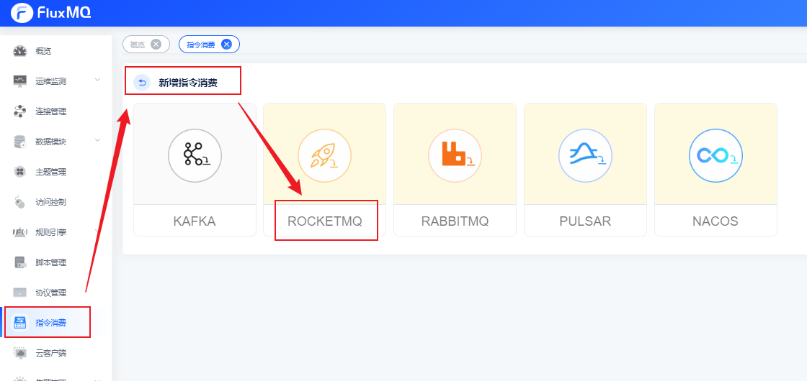
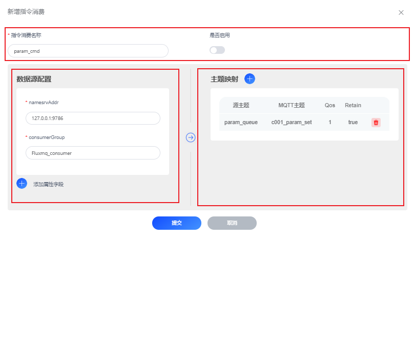
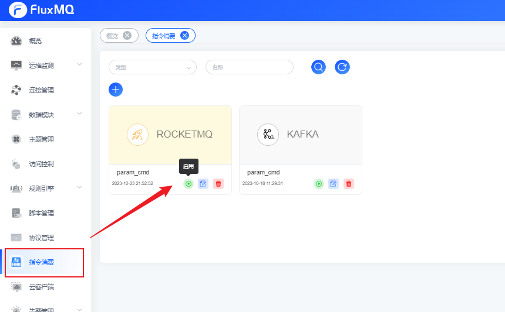

# RocketMQ推送指令

## 场景说明
业务触发的指令下发，会经由RocketMQ消息队列统一接收，再依赖定制服务完成统一下发至网关，通过主题的映射配置可以极大的简化指令下发链路

本示例演示：通过RocketMQ精准推送指令消息。

## 前提条件
- 拥有可使用的RocketMQ实例

## 配置指令消费实例
### 1. 选择左侧导航栏的“指令消费”，单击左上角的“+”来新建指令消费配置。

### 2. 配置界面参考下表参数说明，填写相关内容。以下参数取值仅为示例，填写完成后单击“提交”。

#### 编辑指令消费
| **参数名**   | **参数说明**            |
|-----------|---------------------|
| 指令消费类型    | 默认，如：ROCKETMQ       |
| 指令消费名称    | 指令消费实例名，如：param_cmd |
| 是否启用      | 开启/关闭按钮             |

#### 数据源配置
| **参数名**            | **参数说明**                         |
|--------------------|----------------------------------|
| namesrvAddr        | 指定RocketMQ集群地址，如：127.0.0.1:9786  |
| consumerGroup      | kafka消费组ID，如：fluxmq_consumer     |
| 更多属性               | 通过点击【添加属性字段】，设置更多自定义属性           |

#### 主题映射
| **参数名** | **参数说明**             |
|---------|----------------------|
| 订阅源主题    | 自kafka消费主题名          |
| MQTT主题  | 发送mqtt的主题名           |
| Qos    | 消息语义（至多一次，至少一次，精准一次） |
| Retain  | 指定mqtt主题接收的数据是否保留    |

3. 管理指令消费实例，可以通过看板界面继续编辑、启停用、删除操作
