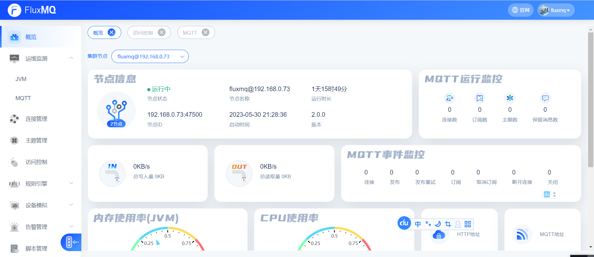
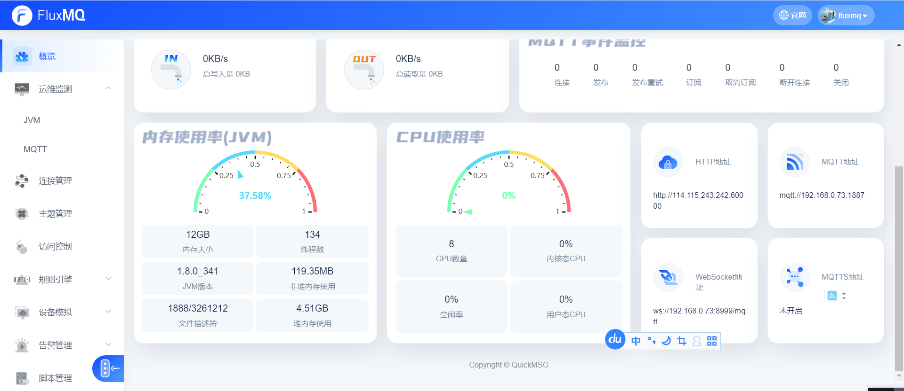
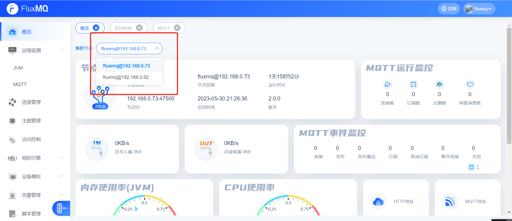
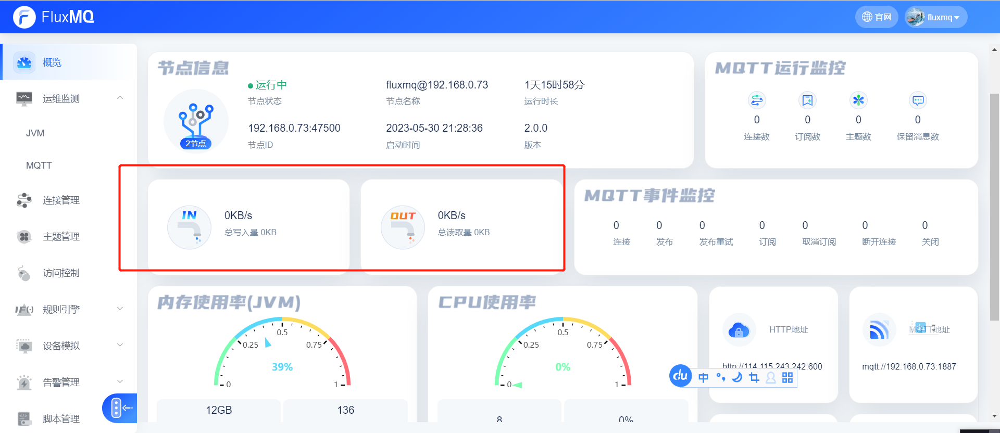
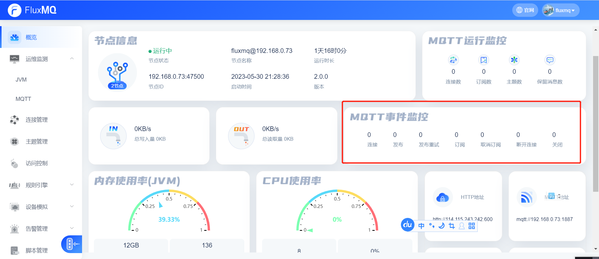
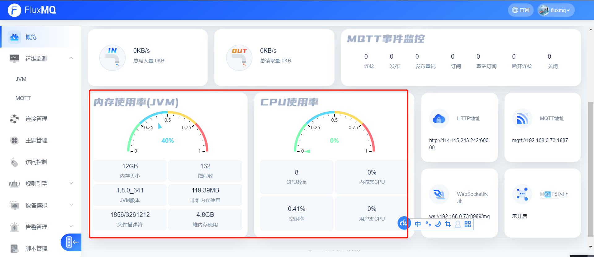
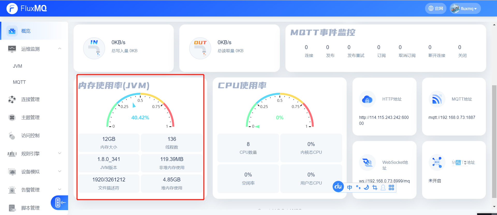
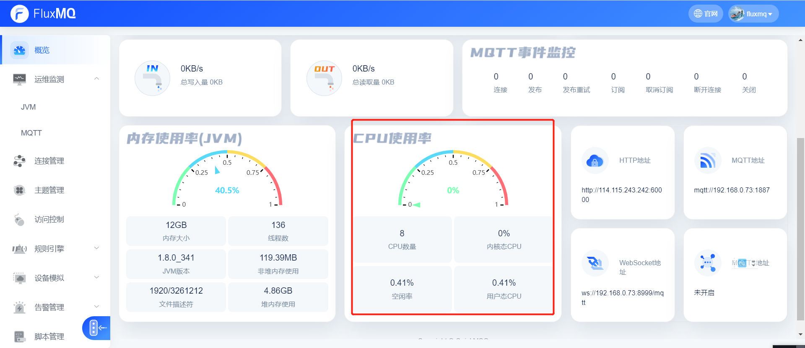
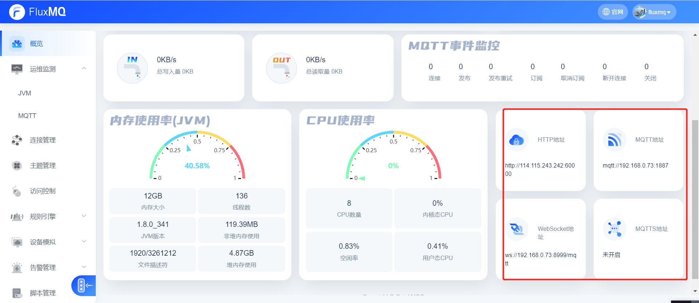

# Dashboard
FluxMQ提供一个后台控制台，用户可通过页面直接看到当前系统的一些运行指标。

## 节点信息
> 单节点统计
当前FluxMQ集群所包含的集群节点，客户通过选择某个节点查看当前系统的运行指标。

| **统计指标** | **说明**                       |
|----------|------------------------------|
| 运行状态     | 运行中                          |
| 节点名称     | fluxmq@节点ip                  |
| 版本       | 2.0.0                        |
| 运行时间     | 2023-05-30 21:28:36          |
| 节点ID     | 192.168.0.73:47500 启动的集群通信端口 |

## MQTT运行监控
> 单节点统计

| **统计指标** | **说明**       |
|----------|--------------|
| 连接数      | 客户端连接数       |
| 订阅数      | 客户端订阅数       |
| 主题数      | 订阅Topic数（去重） |
| 保留消息数    | 保留消息数        |

## 流量统计
> 单节点统计

| **统计指标** | **说明**      |
|----------|-------------|
| 写入速率     | 客户端总得写入速率每秒 |
| 写入总量     | 客户端总得写入两    |
| 读取速率     | 客户端总得读取速率每秒 |
| 读取总量     | 客户端总得读取量    |

## MQTT事件统计
> 单节点统计 ，其他更详细指标请查看监控画板（grafana）

| **统计指标** | **说明**            |
|----------|-------------------|
| 连接       | MQTT的连接数          |
| 发布       | MQTT的Publish事件    |
| 发布重试     | MQTT的发布QOS1、2重发   |
| 订阅       | MQTT的订阅事件         |
| 取消订阅     | MQTT的取消订阅事件       |
| 断开连接     | MQTT的disconnect事件 |
| 关闭       | 连接的close事件        |

## MQTT系统监控

### 内存

### CPU

### Endpoint

