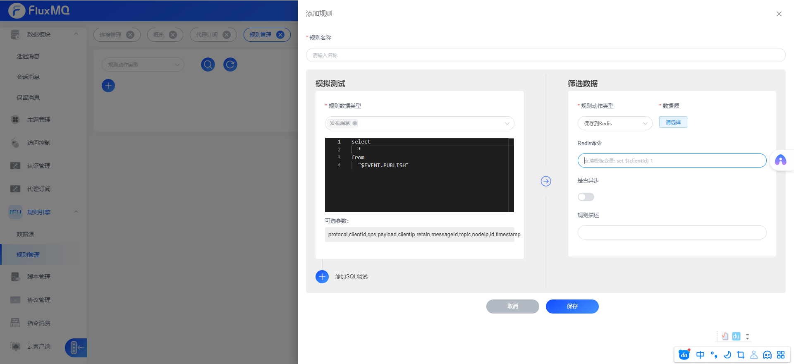

# 保存至redis


##  支持设置redis脚本

### 支持动态获取字段
fluxmq新增redis存储，只需要根据对应的[数据类型](../rule/EVENT.md)数据格式，选择对应的占位符插入即可，

```SHELL
set ${clientId} 1 && set ${clientId} ${timestamp}
```

### Redis指令


目前支持的指令如下：

| 指令                   | 描述              |
|----------------------|-----------------|
| set key value        | 设置key-value     |
| del key              | 删除key           | 
| expire key           | 设置key TTL时间，单位秒 | 
| incr key             | 自增计数            | 
| decr key             | 自减计数            | 
| hset key field value | 添加Hash值         |
| hdel key field  | 删除hash值         |


支持设置多指令,设置规则如下:

```SHELL
 指令1 && 指令2 && 指令3
```

