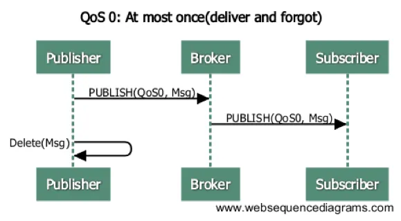
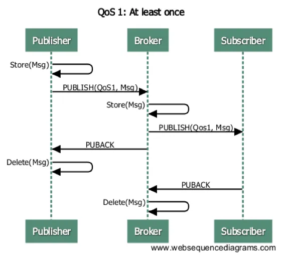

# MQTT协议介绍

## 概览
MQTT是一个轻量的发布订阅模式消息传输协议，专门针对低带宽和不稳定网络环境的物联网应用设计。
MQTT官网: [http://mqtt.org(opens new window)](http://mqtt.org/)
MQTT V3.1.1协议规范: [http://docs.oasis-open.org/mqtt/mqtt/v3.1.1/os/mqtt-v3.1.1-os.html(opens new window)](http://docs.oasis-open.org/mqtt/mqtt/v3.1.1/os/mqtt-v3.1.1-os.html)
## 特点

1. 开放消息协议，简单易实现
2. 发布订阅模式，一对多消息发布
3. 基于TCP/IP网络连接
4. 1字节固定报头，2字节心跳报文，报文结构紧凑
5. 消息QoS支持，可靠传输保证
## 应用
MQTT协议广泛应用于物联网、移动互联网、智能硬件、车联网、电力能源等领域。

1. 物联网M2M通信，物联网大数据采集
2. Android消息推送，WEB消息推送
3. 移动即时消息，例如Facebook Messenger
4. 智能硬件、智能家具、智能电器
5. 车联网通信，电动车站桩采集
6. 智慧城市、远程医疗、远程教育
7. 电力、石油与能源等行业市场
## MQTT基于主题(Topic)消息路由
MQTT协议基于主题(Topic)进行消息路由，主题(Topic)类似URL路径，例如:
```
chat/room/1 sensor/10/temperature sensor/+/temperature $SYS/broker/metrics/packets/received $SYS/broker/metrics/# 
```

主题(Topic)通过'/'分割层级，支持'+', '#'通配符:
```
'+': 表示通配一个层级，例如a/+，匹配a/x, a/y      '#': 表示通配多个层级，例如a/#，匹配a/x, a/b/c/d 
```

订阅者与发布者之间通过主题路由消息进行通信，例如采用mosquitto命令行发布订阅消息:
```
mosquitto_sub -t a/b/+ -q 1 mosquitto_pub -t a/b/c -m hello -q 1 
```

订阅者可以订阅含通配符主题，但发布者不允许向含通配符主题发布消息。
## MQTT V3.1.1协议报文
### 报文结构

- 固定报头(Fixed header)
- 可变报头(Variable header)
- 报文有效载荷(Payload)
### 固定报头
```
+----------+-----+-----+-----+-----+-----+-----+-----+-----+ | Bit      |  7  |  6  |  5  |  4  |  3  |  2  |  1  |  0  | +----------+-----+-----+-----+-----+-----+-----+-----+-----+ | byte1    |   MQTT Packet type    |         Flags         | +----------+-----------------------+-----------------------+ | byte2... |   Remaining Length                            | +----------+-----------------------------------------------+ 
```
### 报文类型
|  |  |  |
| --- | --- | --- |
| 类型名称 | 类型值 | 报文说明 |
| CONNECT | 1 | 发起连接 |
| CONNACK | 2 | 连接回执 |
| PUBLISH | 3 | 发布消息 |
| PUBACK | 4 | 发布回执 |
| PUBREC | 5 | QoS2消息回执 |
| PUBREL | 6 | QoS2消息释放 |
| PUBCOMP | 7 | QoS2消息完成 |
| SUBSCRIBE | 8 | 订阅主题 |
| SUBACK | 9 | 订阅回执 |
| UNSUBSCRIBE | 10 | 取消订阅 |
| UNSUBACK | 11 | 取消订阅回执 |
| PINGREQ | 12 | PING请求 |
| PINGRESP | 13 | PING响应 |
| DISCONNECT | 14 | 断开连接 |

### PUBLISH发布消息
PUBLISH报文承载客户端与服务器间双向的发布消息。 PUBACK报文用于接收端确认QoS1报文，PUBREC/PUBREL/PUBCOMP报文用于QoS2消息流程。
### PINGREQ/PINGRESP心跳
客户端在无报文发送时，按保活周期(KeepAlive)定时向服务端发送PINGREQ心跳报文，服务端响应PINGRESP报文。PINGREQ/PINGRESP报文均2个字节。
## MQTT消息QoS
MQTT发布消息QoS保证不是端到端的，是客户端与服务器之间的。订阅者收到MQTT消息的QoS级别，最终取决于发布消息的QoS和主题订阅的QoS。

| 发布消息的 QoS | 主题订阅的 QoS | 接收消息的 QoS |
| --- | --- | --- |
| 0 | 0 | 0 |
| 0 | 1 | 0 |
| 0 | 2 | 0 |
| 1 | 0 | 0 |
| 1 | 1 | 1 |
| 1 | 2 | 1 |
| 2 | 0 | 0 |
| 2 | 1 | 1 |
| 2 | 2 | 2 |

### Qos0消息发布订阅


### Qos1消息发布订阅


### Qos2消息发布订阅

## MQTT会话(Clean Session)
MQTT客户端向服务器发起CONNECT请求时，可以通过'Clean Session'标志设置会话。
'Clean Session'设置为0，表示创建一个持久会话，在客户端断开连接时，会话仍然保持并保存离线消息，直到会话超时注销。
'Clean Session'设置为1，表示创建一个新的临时会话，在客户端断开时，会话自动销毁。
## MQTT连接保活心跳
MQTT客户端向服务器发起CONNECT请求时，通过KeepAlive参数设置保活周期。
客户端在无报文发送时，按KeepAlive周期定时发送2字节的PINGREQ心跳报文，服务端收到PINGREQ报文后，回复2字节的PINGRESP报文。
服务端在1.5个心跳周期内，既没有收到客户端发布订阅报文，也没有收到PINGREQ心跳报文时，主动心跳超时断开客户端TCP连接。
emqx 消息服务器默认按最长 2.5 心跳周期超时设计。
## MQTT遗愿消息(Last Will)
MQTT客户端向服务器端CONNECT请求时，可以设置是否发送遗愿消息(Will Message)标志，和遗愿消息主题(Topic)与内容(Payload)。
MQTT客户端异常下线时(客户端断开前未向服务器发送DISCONNECT消息)，MQTT消息服务器会发布遗愿消息。
## MQTT保留消息(Retained Message)
MQTT客户端向服务器发布(PUBLISH)消息时，可以设置保留消息(Retained Message)标志。保留消息(Retained Message)会驻留在消息服务器，后来的订阅者订阅主题时仍可以接收该消息。
例如mosquitto命令行发布一条保留消息到主题'a/b/c':
```
mosquitto_pub -r -q 1 -t a/b/c -m 'hello' 
```

之后连接上来的MQTT客户端订阅主题'a/b/c'时候，仍可收到该消息:
```
$ mosquitto_sub -t a/b/c -q 1 hello 
```

保留消息(Retained Message)有两种清除方式:

1. 客户端向有保留消息的主题发布一个空消息:
```
mosquitto_pub -r -q 1 -t a/b/c -m '' 
```

1. 消息服务器设置保留消息的超期时间。
## MQTT WebSocket连接
MQTT协议除支持TCP传输层外，还支持WebSocket作为传输层。通过WebSocket浏览器可以直连MQTT消息服务器，发布订阅模式与其他MQTT客户端通信。
MQTT协议的WebSocket连接，必须采用binary模式，并携带子协议Header:
```
Sec-WebSocket-Protocol: mqttv3.1 或 mqttv3.1.1 
```

## MQTT 与 XMPP 协议对比
MQTT协议设计简单轻量、路由灵活，将在移动互联网物联网消息领域，全面取代PC时代的XMPP协议:

1. MQTT协议一个字节固定报头，两个字节心跳报文，报文体积小编解码容易。XMPP协议基于繁重的XML，报文体积大且交互繁琐。
2. MQTT协议基于主题(Topic)发布订阅模式消息路由，相比XMPP基于JID的点对点消息路由更为灵活。
3. MQTT协议未定义报文内容格式，可以承载JSON、二进制等不同类型报文。XMPP协议采用XML承载报文，二进制必须Base64编码等处理。
4. MQTT协议支持消息收发确认和QoS保证，XMPP主协议并未定义类似机制。MQTT协议有更好的消息可靠性保证。
## MQTT-SN 协议
MQTT-SN 协议是 MQTT 的直系亲属，它使用 UDP 进行通信，标准的端口是1884。MQTT-SN 的主要目的是为了适应受限的设备和网络，比如一些传感器，只有很小的内存和 CPU，TCP 对于这些设备来说非常奢侈。还有一些网络，比如 ZIGBEE，报文的长度在300字节以下，无法承载太大的数据包。所以 MQTT-SN 的数据包更小巧。
MQTT-SN 的官方标准下载地址: [http://mqtt.org/new/wp-content/uploads/2009/06/MQTT-SN_spec_v1.2.pdf(opens new window)](http://mqtt.org/new/wp-content/uploads/2009/06/MQTT-SN_spec_v1.2.pdf)
## MQTT-SN 和 MQTT 的区别
MQTT-SN 的信令和 MQTT 大部分都相同，比如都有 Will, 都有 Connect/Subscribe/Publish 命令.
MQTT-SN 最大的不同是，Topic 使用 TopicId 来代替，而 TopicId 是一个16比特的数字。每一个数字对应一个 Topic, 设备和云端需要使用 REGISTER 命令映射 TopicId 和 Topic 的对应关系。
MQTT-SN 可以随时更改 Will 的内容, 甚至可以取消. 而 MQTT 只允许在 CONNECT 时设定 Will 的内容, 而且不允许更改.
MQTT-SN 的网络中有网关这种设备，它负责把 MQTT-SN 转换成 MQTT，和云端的 MQTT Broker 通信. MQTT-SN 的协议支持自动发现网关的功能。
MQTT-SN 还支持设备的睡眠功能，如果设备进入睡眠状态，无法接收 UDP 数据，网关将把下行的 PUBLISH 消息缓存起来，直到设备苏醒后再传送。
