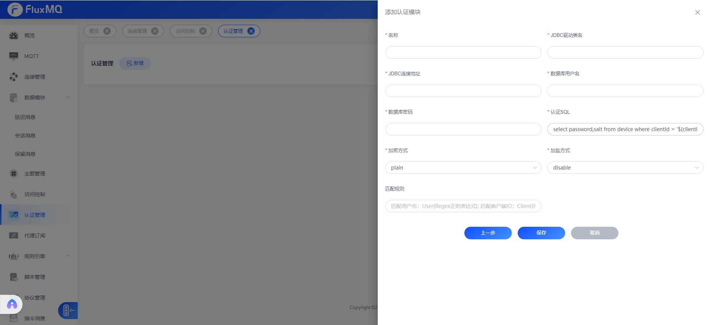

# 数据库认证

> SQL认证是指客户端连接时，通过数据库进行认证，这种方式适用于客户端数量较多的场景，例如生产环境。



## 驱动选择
| **驱动方式**                | **释义**     |
|-------------------------|------------|
| com.mysql.cj.jdbc.Driver | mysql      |
| oracle.jdbc.OracleDriver | oracle     |
|  com.microsoft.sqlserver.jdbc.SQLServerDriver  | sqlserver  |
| org.postgresql.Driver                   | postgresql |


## sql查询语句

> 使用 ${认证实体变量名}去引用认证实体中的属性，例如：${username} 代表认证实体中的username属性。查询必须返回`password`字段、`salt`字段可选。如果没有返回`password`字段，则认证失败


```sql
select password,salt from device where username = '${username}' limit 1
```
查询支需要返回一条即可完成认证。

## 加密


### 加密算法

> 加密后的`password`不区分大小写

| **加密方式** | **释义**   |
|----------|----------|
| plain    | 明文       |
| md5      | md5加密    |
| sha1      | sha1加密   |
| sha256     | sha256加密 |
| sha512     | sha512加密 |

### 盐

> 目前支持三种加盐策略


| **加盐策略** | **释义**           |
|----------|------------------|
| disable  | 不加盐              |
| prefix   | `salt`+`password`  |
| suffix   | `password` +`salt` |

## 认证规则

现在新增认证管理器支持正则匹配clientId,定向路由认证管理器,可以操作clientId、username,具体语法如下：
-  客户端ID匹配正则 `Client{regex}`
-  用户名匹配正则  `User{regex}`

如果不配置正则表达式，表示匹配所有，所有请求都将会走该认证管理器。


