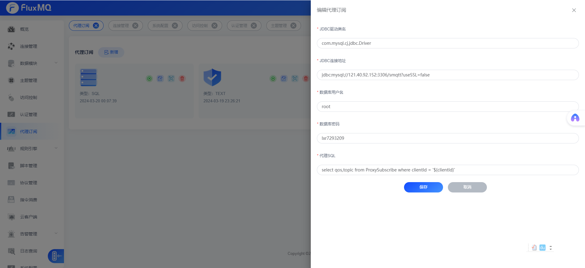
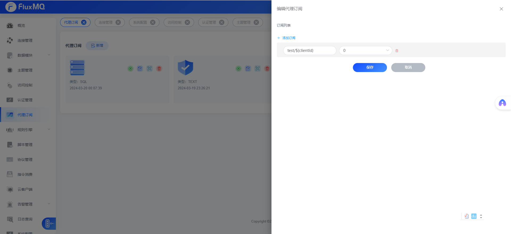

# 代理订阅

> 代理订阅是指服务端支持设置主题规则，设备连接后无需要发送订阅报文，FluxMQ会自动建立设备与代理主体的订阅关系，设备从而收到改订阅主题的报文


## 数据库代理订阅



> 默认FluxMQ允许通过占位符匹配客户端Id跟用户名密码,

```json
{
  "clientId" : "A123123123213",
  "username": "sjknwjsjnfsdn"
}

```
SQL查询返回的主题跟服务级别字段必须是`topic` 、`qos`， 如果不是该字段名称，则可以使用别名将字段转成其命令


## 固定代理订阅


可以设置多个主题，每个主题可以使用占位符去拼接主题，允许匹配 `clientId`、 `username`。

