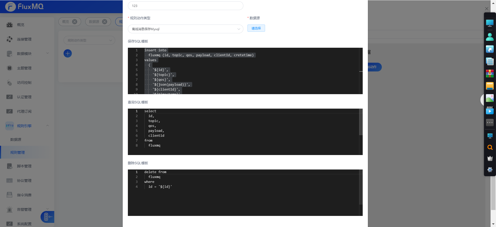

# 离线存储MYSQL


##  sql设置

### 保存sql

可以动态选择要插入的数据库表，以及字段的映射
```sql
insert into
  fluxmq (id, topic, qos, payload, clientId, cretetime)
values
  (
    '${id}',
    '${topic}',
    '${qos}',
    '${json(payload)}',
    '${clientId}',
    '${timestamp}'
  )
```
### 查询sql

查询必须返回 `id`, `topic`, `qos`,`payload`字段，字段名称不一致请使用别名。

```sql
select
  id,
  topic,
  qos,
  payload
from
  fluxmq
```

###  删除sql

根据message的uid进行删除

```sql
delete from
  fluxmq
where
  id = '${id}'
```

