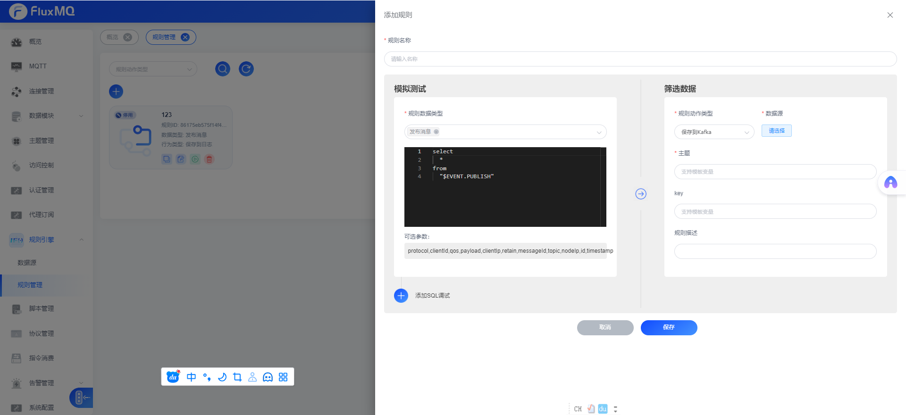

# 保存至kafka



## 主题设置
fluxmq支持动态设置kafka主题，主题分为以下2种，

### 固定主题
例如`iot_device_data`固定主题。

### 占位符主题

比如我们有以下的发布消息数据格式:
> `payload`默认是设备上报的消息结构体，外层结构是fluxmq额外添加可获取的信息，具体可查看： [数据类型](../rule/EVENT.md)

```json
{
    "protocol": "MQTT",
    "id": "8ace2bbab65b4fb1a0afc7c77419e6b5",
    "payload": {
      "id": "A17632123",
      "data": {
        "12": 123,
        "11": 12321
      }
    },
    "messageId": 1,
    "topic": "test",
    "qos": 1,
    "retain": false,
    "timestamp": "1690599987495",
    "clientId": "A1212313",
    "clientIp": "183.136.225.31",
    "nodeIp": "192.168.1.12"
}

```
我们要根据payload里的id字段，动态去发送到对应的主题，那这时候需要设置`${payload.id}` 即可


## 分区key

一般我们需要使用设备的ID作为分区key，只需要设置`${clientId}`即可
