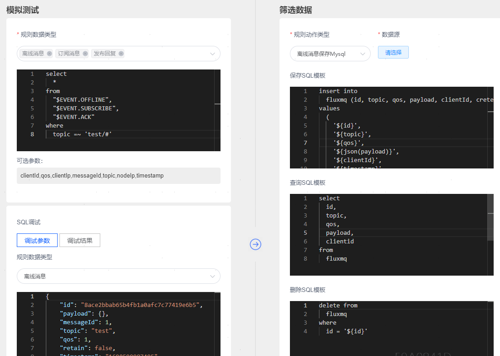

<a id="jump2">SQL 事件类型与字段</a>
# SQL 事件类型与字段
规则的 SQL 语句可以处理 MQTT事件 消息，或者是具有数据流入能力的数据桥接。<br />SQL 语句使用 FROM 来指定 MQTT事件，在 SELECT 和 WHERE 子句中可以引用相应的字段。 <br />数据源类型不同，可以使用的字段也不同。

## 客户端事件
规则的 SQL 语句可以处理事件(发布消息、客户端上下线、客户端订阅等)，FROM 子句后面跟事件主题。<br />事件主题以 $EVENT/ 开头，比如 $EVENT.PUBLISH,$EVENT.SUBSCRIBE 。

| **事件名称** | **事件主题名**          | **释义**    |
|----------|--------------------|-----------|
| 发布事件     | $EVENT.PUBLISH     | 发布消息      |
| 订阅事件     | $EVENT.SUBSCRIBE   | 订阅成功消息    |
| 取消订阅事件   | $EVENT.UNSUBSCRIBE | 取消订阅成功消息  |
| 发布回复事件   | $EVENT.ACK         | 消息接收成功并回复 |
| 心跳事件     | $EVENT.PING        | 连接保活心跳消息  |
| 取消连接事件   | $EVENT.DISCONNECT  | 客户端主动断开连接 |
| 连接断开事件   | $EVENT.CLOSE       | 服务端关闭连接   |
| 建立连接事件   | $EVENT.CONNECT     | 连接成功      |
| 离线消息事件   | $EVENT.OFFLINE     | 离线期间接收的消息 |


### 发布事件 ("$EVENT.PUBLISH")
当消息被放入底层socket时触发规则。

| **字段**    | **解释**             |
|-----------|--------------------|
| id        | 消息唯一标识,客户端publish会生成唯一Id,当qos>0时候，Ack消息会携带此id，代表一次完成应答操作             |
| payload   | MQTT 消息体           |
| messageId | MQTT 消息 ID         |
| topic     | MQTT 主题            |
| qos       | MQTT 消息的 QoS       |
| retain    | MQTT 消息是否保持        |
| timestamp | 事件触发时间 (单位：毫秒)     |
| clientId  | 客户端 ID             |
| clientIp  | 客户端的 IPAddress     |
| nodeIp    | 事件触发所在节点 IPAddress |

示例
```plsql
select
  *
from
  "$EVENT.PUBLISH"
```
输出
```json
{
    "id": "8ace2bbab65b4fb1a0afc7c77419e6b5",
    "payload": {},
    "messageId": 1,
    "topic": "test",
    "qos": 1,
    "retain": false,
    "timestamp": "1690599987495",
    "clientId": "A1212313",
    "clientIp": "183.136.225.31",
    "nodeIp": "192.168.1.12"
}
```

### 发布回复事件 ("$EVENT.ACK")
当消息发送到客户端，并收到客户端回复的ack时触发规则，仅QOS1，QOS2会触发。

| **字段**    | **解释**                                                   |
|-----------|----------------------------------------------------------|
| id        | 消息唯一标识,客户端publish会生成唯一Id,当qos>0时候，Ack消息会携带此id，代表一次完成应答操作 |
| payload   | MQTT 消息体                                                 |
| messageId | MQTT 消息 ID                                               |
| topic     | MQTT 主题                                                  |
| qos       | MQTT 消息的 QoS                                             |
| timestamp | 事件触发时间 (单位：毫秒)                                           |
| clientId  | 客户端 ID                                                   |
| clientIp  | 客户端的 IPAddress                                           |
| nodeIp    | 事件触发所在节点 IPAddress                                       |
| desc      | 回复描述，用于区分qos1,2消息回复                                      |

* desc字段枚举 

| **字段** | **解释**    |
|--------|-----------|
| ack    | QoS1 回复   |
| rec    | QoS2 发布确认 |
| comp   | QoS2 发布完成 |

示例
```plsql
select
  *
from
  "$EVENT.ACK"
```
输出
```json
{
    "id": "8ace2bbab65b4fb1a0afc7c77419e6b5",
    "messageId": 10001,
    "clientId": "A1212313",
    "payload": {},
    "topic": "test",
    "qos": 1,
    "timestamp": "1690599987495",
    "clientIp": "183.136.225.31",
    "nodeIp": "192.168.1.1",
    "desc": "ack"
}
```

### 建立连接事件 ("$EVENT.CONNECT")
当客户端连接成功时触发规则。

| **字段**           | **解释**             |
|------------------|--------------------|
| clientIp         | 客户端的 IPAddress     |
| nodeIp           | 事件触发所在节点 IPAddress |
| version          | 使用的协议 版本           |
| keepalive        | MQTT 保活间隔          |
| cleanSession     | 是否清空会话             |
| auth.username    | 客户端用户名             |
| auth.password    | 客户端密码              |
| will.isRetain    | 遗嘱消息是否保持           |
| will.willTopic   | 遗嘱消息主题             |
| will.willQos     | 遗嘱消息语义级别           |
| will.willMessage | 遗嘱消息内容             |
| timestamp        | 事件触发时间 (单位：毫秒)     |
| clientId         | 客户端 ID             |

示例
```plsql
select
  *
from
  "$EVENT.CONNECT"
```
输出
```json
{
    "clientIp": "192.168.0.100",
    "nodeIp": "127.0.0.1",
    "version": "MQTT_3_1",
    "keepalive": 120,
    "cleanSession": false,
    "auth": {
        "username": "fluxmq",
        "password": "fluxmq"
    },
    "will": {
        "isRetain": false,
        "willTopic": "willTest",
        "willQos": 1,
        "willMessage": ""
    },
    "timestamp": "1690599987495",
    "clientId": "A1212313"
}
```

### 取消连接事件 ("$EVENT/DISCONNECT")
当客户端连接断开时触发规则。

| **字段**   | **解释**             |
|----------|--------------------|
| clientId | 客户端 ID             |
| time     | 事件触发时间             |
| clientIp | 客户端的 IPAddress     |
| nodeIp   | 事件触发所在节点 IPAddress |

示例
```plsql
select
  *
from
  "$EVENT.DISCONNECT"
```
输出
```json
{
    "clientId": "A1212313",
    "time": "2022 12-22 12:00:00",
    "clientIp": "183.136.225.31",
    "nodeIp": "192.168.1.1"
}
```

### 订阅事件 ("$EVENT/SUBSCRIBE")
当客户端订阅成功时触发规则。

| **字段**    | **解释**             |
|-----------|--------------------|
| messageId | MQTT 消息 ID         |
| topic     | MQTT 主题            |
| qos       | MQTT 消息的 QoS       |
| clientId  | 客户端 ID             |
| timestamp | 事件触发时间             |
| clientIp  | 客户端的 IPAddress     |
| nodeIp    | 事件触发所在节点 IPAddress |

示例
```plsql
select
  *
from
  "$EVENT.SUBSCRIBE"
```
输出
```json
{
    "messageId": 1,
    "topic": "test",
    "qos": 1,
    "clientIp": "183.136.225.31:21950",
    "timestamp": "1690599987495",
    "clientId": "A1212313",
    "nodeIp": "192.168.1.12"
}
```

### 客户端取消订阅成功事件 ("$EVENT/UNSUBSCRIBE")
当客户端取消订阅成功时触发规则。

| **字段**    | **解释**             |
|-----------|--------------------|
| messageId | MQTT 消息 ID         |
| topic     | MQTT 主题            |
| clientId  | 客户端 ID             |
| timestamp | 事件触发时间             |
| clientIp  | 客户端的 IPAddress     |
| nodeIp    | 事件触发所在节点 IPAddress |

示例
```plsql
select
  *
from
  "$EVENT.UNSUBSCRIBE"
```
输出
```json
{
    "messageId": 1,
    "topic": "test",
    "clientIp": "183.136.225.31:21950",
    "timestamp": "1690599987495",
    "clientId": "A1212313",
    "nodeIp": "192.168.1.1"
}
```

### 心跳事件 ("$EVENT.PING")
当客户端推送保活心跳时触发规则。

| **字段**    | **解释**             |
|-----------|--------------------|
| clientId  | 客户端 ID             |
| timestamp | 事件触发时间             |
| clientIp  | 客户端的 IPAddress     |
| nodeIp    | 事件触发所在节点 IPAddress |

示例
```plsql
select
  *
from
  "$EVENT.PING"
```
输出
```json
{
    "clientId": "A1212313",
    "timestamp": "1690599987495",
    "clientIp": "183.136.225.31",
    "nodeIp": "192.168.1.1"
}
```

### 连接断开事件 ("$EVENT.CLOSE")
当服务端关闭连接时触发规则。

| **字段**    | **解释**             |
|-----------|--------------------|
| messageId | MQTT 消息 ID         |
| reason    | 连接断开原因描述           |
| clientId  | 客户端 ID             |
| timestamp | 事件触发时间             |
| clientIp  | 客户端的 IPAddress     |
| nodeIp    | 事件触发所在节点 IPAddress |

`reason`连接断开原因：

    NORMAL("normal", "客户端主动关闭"),

    KICKED("kicked", "服务端主动关闭"),

    TIMEOUT("timeout", "客户端心跳超时关闭"),

    NOT_AUTHORIZED("not_authorized", "认证失败关闭"),

    DISCONNECT("disconnect", "客户端主动关闭"),

    OTHER_KICKED("other_kicked", "集群互踢");

| **字段**    | **解释**             |
|-----------|--------------------|
| normal | 客户端主动关闭         |
| kicked    | 服务端主动关闭           |
| timeout  | 客户端心跳超时关闭            |
| not_authorized | 认证失败关闭             |
| other_kicked  | 集群互踢    |
| disconnect  | 客户端主动关闭     |


示例
```plsql
select
  *
from
  "$EVENT.CLOSE"
```
输出
```json
{
    "messageId": 1,
    "reason": "",
    "timestamp": "1690599987495",
    "clientId": "A1212313",
    "clientIp": "183.136.225.31",
    "nodeIp": "192.168.1.1"
}
```

### 离线消息事件 ("$EVENT.OFFLINE")

- 离线消息必须是Qos=1或者Qos=2的消息
- 当客户端发布的消息没有客户端订阅时，那么此消息被定义为离线消息
- ACK未确认的qos=1或者qos=2的消息，也会被定义为离线消息

配置**离线消息**，将离线消息持久化到Mysql，Redis，PostgreSQL数据库中。<br />配置**订阅消息**，将离线消息根据订阅主题推送给客户端。<br />配置**发布回复**，根据客户端的ACK回复，从数据库中删除离线消息。<br />即同时选择：离线消息、订阅消息、发布回复三种类型。<br />可以为SQL添加topic过滤条件，比如topic =~ 'test/#'<br />

| **字段**    | **解释**              |
|-----------|---------------------|
| id        | 消息唯一标识              |
| payload   | MQTT 消息体            |
| messageId | MQTT 消息 ID          |
| topic     | MQTT 主题             |
| qos       | MQTT 消息的 QoS        |
| retain    | MQTT 消息是否保持         |
| timestamp | 事件触发时间 (单位：毫秒)      |
| clientId  | 客户端 ID              |
| clientIp  | 客户端的 IPAddress      |
| nodeIp    | 事件触发所在节点 IPAddress  |


示例
```plsql
select
  *
from
  "$EVENT.OFFLINE"
```
输出
```json
{
    "id": "8ace2bbab65b4fb1a0afc7c77419e6b5",
    "payload": {},
    "messageId": 1,
    "topic": "test",
    "qos": 1,
    "retain": false,
    "timestamp": "1690599987495",
    "clientId": "A1212313",
    "clientIp": "183.136.225.31",
    "nodeIp": "192.168.1.1"
}
```