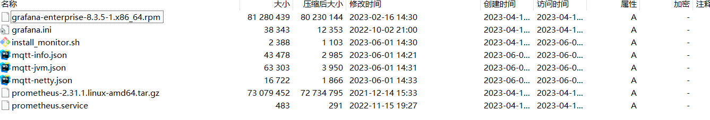

# 集成Prometheus+Grafana

## 下载安装脚本
```shell
https://fluxmq.obs.cn-east-3.myhuaweicloud.com/install_monitor.zip
```

上传安装包install_monitor.zip 到服务器上，解压后包含以下文件


```shell
> 
```shell
unzip install_monitor.zip
#进入解压目录
cd ~/install_monitor
#执行部署脚本 后面的ip端口修改成具体的网关节点ip端口，如果有多个请用逗号隔开
sh install_monitor.sh  192.168.1.12:60000,192.168.2.14:60000
```
## 2. 验证
prometheus ui界面 ：http://ip:9090

grafana ui界面：http://ip:3000/login


## 3. grafana 图表导入
浏览器打开http://ip:3000/login,输入用户名、密码(admin/admin)


## 4. 导入json
> 下载下面2个json文件，分别是mqtt-info.json、mqtt-jvm.json，导入即可监控fluxmq系统

[MQTT监控](https://fluxmq.obs.cn-east-3.myhuaweicloud.com/mqtt-info.json)

[JVM监控](https://fluxmq.obs.cn-east-3.myhuaweicloud.com/mqtt-jvm.json)


## 采集Metrics
FluxMQ为提供Prometheus指标接口直接获取Metrics信息,具体指标详情参考下面[Metrics](metrics.md)

```text
http://{节点IP}:{HTTP端口}/public/metrics
```

## 与Grafana集成
下载后导入Grafana 即可:

