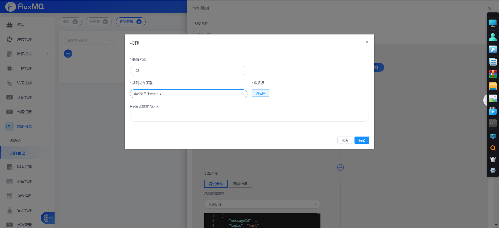

# 离线存储redis

##  设置过期时间

> 不设置值时，默认消息保留7天

## 存储结构
默认采用Hash结构存储在redis中

| key                   | field     | value       |
|----------------------|-----------|-------------|
| MQTT:消息uid          | 离线消息字段key | 离线消息字段value |

