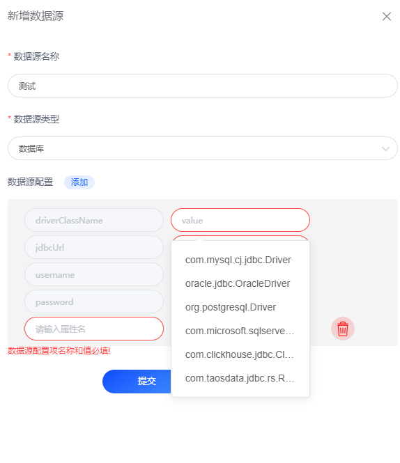

# 数据库

## 支持的数据库

| 数据库         | 版本         | 支持 |
|:------------|:-----------| :--- |
| MySQL       | 5.6+       | 支持 |
| PostgreSQL  | 9.6+       | 支持 |
| Oracle      | ojdbc8-19  | 支持 |
| SQL Server  | 6.2.0.jre8 | 支持 |
| Redis       | 2.9.2      | 支持 |
| TDengine    | 3.2.2      | 支持 |
| ClickHourse | 0.3.2      | 支持 |

## 数据库配置
### 选择数据库类型对应的驱动

### 配置数据库连接信息
- JdbcUrl
- 用户名
- 密码
- 连接池参数(可选)

