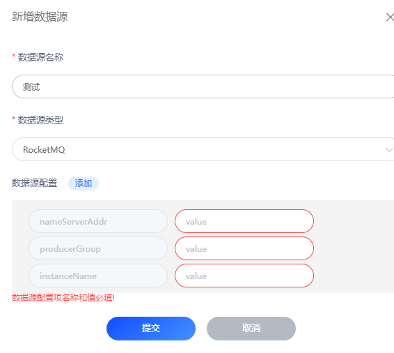

# RocketMQ
FluxMQ提供了RocketMQ的接入功能，可以将消息发送到RocketMQ中。

## RocketMQ配置

| 配置项           | 说明                              |
|---------------|---------------------------------|
| nameServer地址  | NameServer的地址，比如：localhost:9876 |
| producerGroup | 生产者组，比如：producerGroup           |
| instanceName  | 实例名称                            |