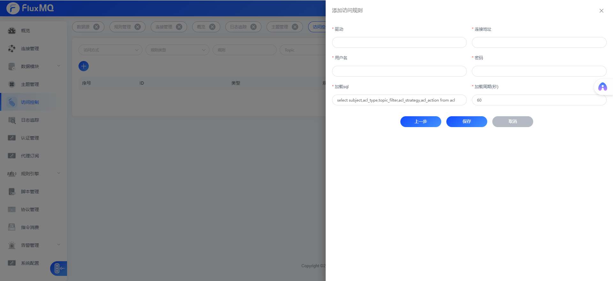

# SQL配置方式



通过SQL配置方式去加载ACL规则，当外部数据库ACL规则发生变化后，FluxMQ会定时去刷新ACL缓存，实现ACL缓存的热更新。

## ACL拦截规则

当客户端建立连接后，会加载ACL缓存(默认60S定时刷新),客户端发布订阅后，会根据其主题匹配是否存在`deny`规则，如果不存在`deny`规则，则ACl检查通过
,如果存在Deny规则，再去检查是否存在`allow`规则,如果存在`allow`规则，acl检查通过，否则失败。


## 配置

| **配置项** | **释义**         |
|---------|----------------|
| 驱动      | 选择对应数据库的jdbc驱动 |
| 连接地址    | 数据库的连接地址       |
| 用户名     | 数据库用户名         |
| 密码      | 数据库密码          |
| 加载sql   | 详情见如下`SQL配置`     |
| 加载周期    | 定时去数据库刷新ACL缓存  |

## SQL配置

> 查询时必须返回 `subject` ,`acl_type`,`topic`,`acl_strategy`,`acl_action` 字段
> 如果数据库字段有区分，请使用别名。

默认sql如下:
```SQL
select subject,acl_type,topic,acl_strategy,acl_action from acl
```
具体字段配置请查看 [ACL介绍](before)
