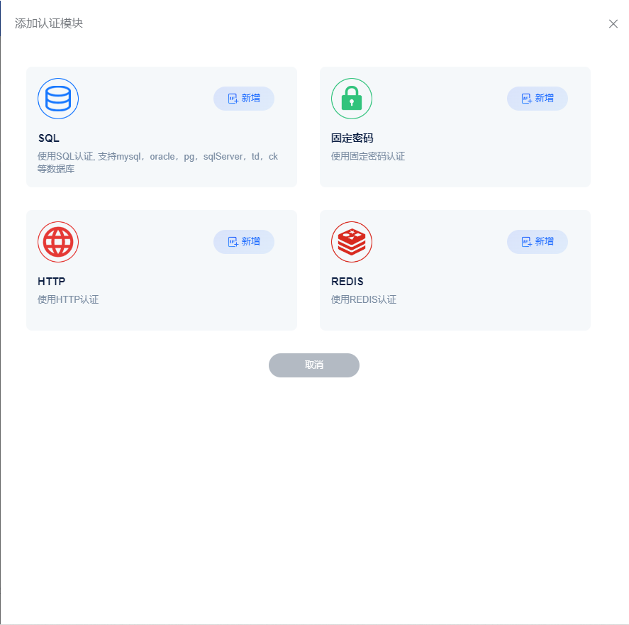

# 认证管理
身份认证是大多数应用的重要组成部分，MQTT 协议支持用户名密码认证，启用身份认证能有效阻止非法客户端的连接。
FluxMQ支持配配置多个认证方式，当配置多认证时候，连接会依次尝试认证，只要有一种认证方式通过即可连接成功。



## 认证实体


### 未开启HAProxy

```json

{
  "clientId":"Akjdksdnfdjsnfjk",
  "username": "test",
  "password": "yess"
}

```


### 开启HAProxy

```json

{
  "clientId":"Akjdksdnfdjsnfjk",
  "username": "test",
  "password": "yess",
  "destinationAddress": "127.0.0.1",
  "destinationPort": 1883,
  "sourcePort": 1883,
  "sourceAddress": "12.12.12.12"
}

```

如果TLS终结在HAProxy层，则认证实体如下：

```json

{
  "clientId":"Akjdksdnfdjsnfjk",
  "username": "test",
  "password": "yess",
  "destinationAddress": "127.0.0.1",
  "destinationPort": 1883,
  "sourcePort": 1883,
  "sourceAddress": "12.12.12.12",
  "ssl": "jhbzsuiy238",
  "sslCn": "clientId",
  "sslVersion": "TLS1.3"
}

```
