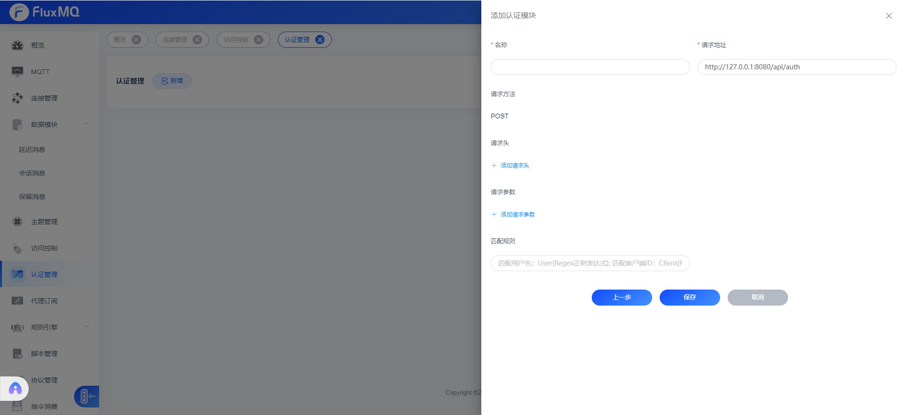

# http认证

> HTTP认证是指客户端连接时，通过HTTP接口进行认证，这种方式适用于客户端数量较多的场景，例如生产环境。
> 默认只支持POST请求，请求Content-Type为application/json，请求体为上述认证实体。 HTTP认证返回状态码为200时，认证成功，否则认证失败。

## 配置

| **參數**  | **释义**                                  |
|---------|-----------------------------------------|
| url     | http://127.0.0.1:8080/api/auth          |
| headers | 设置请求header                              |
| 请求参数    | 默认采用POST，Body为JSON的传输格式，支持在body中添加额外的参数 |

## 认证规则

现在新增认证管理器支持正则匹配clientId,定向路由认证管理器,可以操作clientId、username,具体语法如下：
-  客户端ID匹配正则 `Client{regex}`
-  用户名匹配正则  `User{regex}`

如果不配置正则表达式，表示匹配所有，所有请求都将会走该认证管理器。

