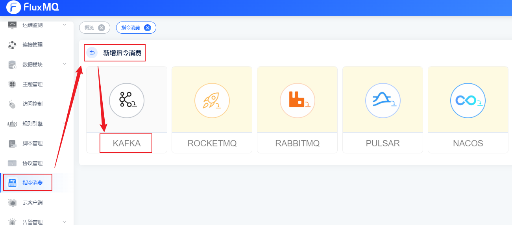
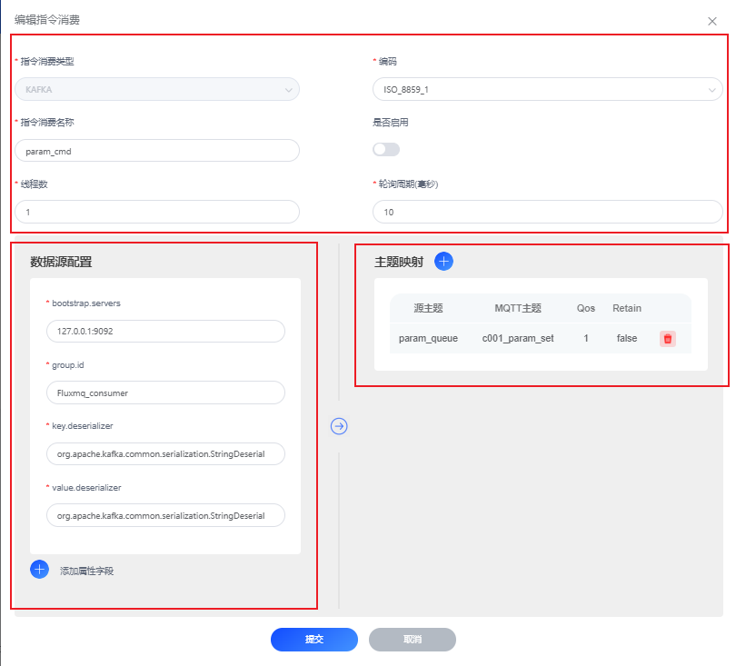

# Kafka推送指令

## 场景说明
业务触发的指令下发，会经由kafka消息队列统一接收，再依赖定制服务完成统一下发至网关，通过主题的映射配置可以极大的简化指令下发链路

本示例演示：通过kafka精准推送指令消息。

## 前提条件
- 拥有可使用的kafka实例

## 配置指令消费实例
### 1. 选择左侧导航栏的“指令消费”，单击左上角的“+”来新建指令消费配置。

### 2. 配置界面参考下表参数说明，填写相关内容。以下参数取值仅为示例，填写完成后单击“提交”。

#### 编辑指令消费
| **参数名** | **参数说明**                 |
|---------|--------------------------|
| 指令消费类型  | 默认，如：KAFKA               |
| 指令消费名称  | 指令消费实例名，如：param_cmd      |
| 线程      | 异步处理线程数                  |
| 编码      | 数据传输转换编码，如：ISO_8859_1    |
| 是否启用    | 开启/关闭按钮                  |
#### 数据源配置
| **参数名**            | **参数说明**                     |
|--------------------|------------------------------|
| bootstrap.servers  | 指定kafka集群地址，如：127.0.0.1:9092 |
| group.id           | kafka消费组ID，如：fluxmq_consumer |
| key.deserializer   | 指定键的反序列化方式                   |
| value.deserializer | 指定键的反序列化方式                   |
| 更多属性             | 通过点击【添加属性字段】，设置更多自定义属性       |

#### 主题映射
| **参数名** | **参数说明**                                           |
|---------|----------------------------------------------------|
| 订阅源主题    | 自kafka消费主题名                                        |
| MQTT主题  | 发送mqtt的主题名（如果下发的指令是JSON格式，可以通过${变量名}动态映射主题,参考下面参数集 |
| Qos    | 消息语义（至多一次，至少一次，精准一次）                               |
| Retain  | 指定mqtt主题接收的数据是否保留                                  |

#### 变量集

| **参数名**            | **参数说明**                                    | **参数结构**          |
|--------------------|---------------------------------------------|-------------------|
| value  | kafka的报文体，如果是`json`格式，可以通过`value.{key}`获取变量 | Object            |
| ts         | kafka消息的时间戳                                 | Long              |
| ts_type   | kafka消息的类型                                  | String            |
| topic | kafka主题                                     | String            |
| offset             | 消息偏移量                                       | Long              |
| headers             | 消息header,可以通过 `headers.{key}`获取header       | Map|
