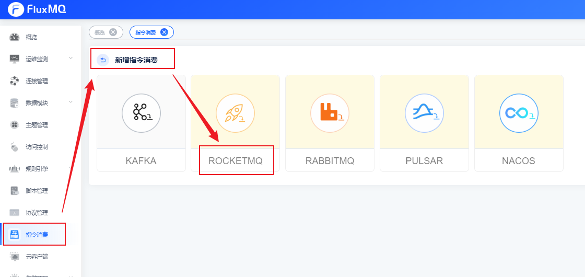
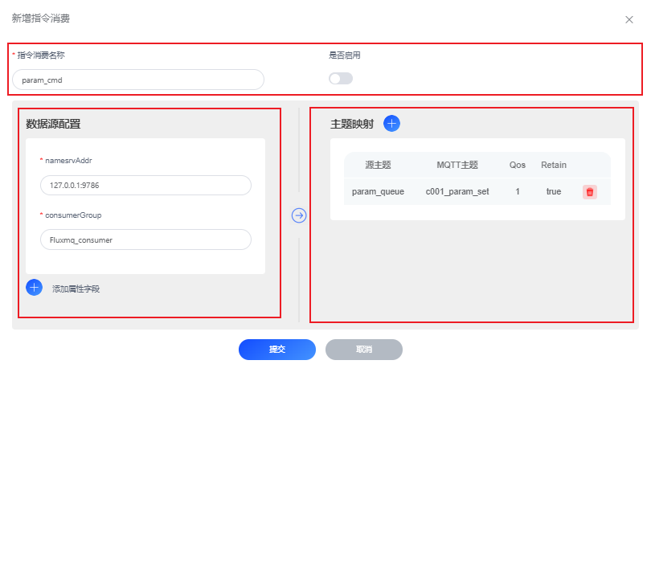

# RocketMQ推送指令

## 场景说明
业务触发的指令下发，会经由RocketMQ消息队列统一接收，再依赖定制服务完成统一下发至网关，通过主题的映射配置可以极大的简化指令下发链路

本示例演示：通过RocketMQ精准推送指令消息。

## 前提条件
- 拥有可使用的RocketMQ实例

## 配置指令消费实例
### 1. 选择左侧导航栏的“指令消费”，单击左上角的“+”来新建指令消费配置。

### 2. 配置界面参考下表参数说明，填写相关内容。以下参数取值仅为示例，填写完成后单击“提交”。

#### 编辑指令消费
| **参数名**   | **参数说明**            |
|-----------|---------------------|
| 指令消费类型    | 默认，如：ROCKETMQ       |
| 指令消费名称    | 指令消费实例名，如：param_cmd |
| 是否启用      | 开启/关闭按钮             |

#### 数据源配置
| **参数名**            | **参数说明**                         |
|--------------------|----------------------------------|
| namesrvAddr        | 指定RocketMQ集群地址，如：127.0.0.1:9786  |
| consumerGroup      | kafka消费组ID，如：fluxmq_consumer     |
| 更多属性               | 通过点击【添加属性字段】，设置更多自定义属性           |

#### 主题映射
| **参数名** | **参数说明**                                            |
|---------|-----------------------------------------------------|
| 订阅源主题    | 自rocketmq消费主题名                                      |
| MQTT主题  | 发送mqtt的主题名（如果下发的指令是JSON格式，可以通过${变量名}动态映射互踢）,参考下面参数集 |
| Qos    | 消息语义（至多一次，至少一次，精准一次）                                |
| Retain  | 指定mqtt主题接收的数据是否保留                                   |

#### 变量集

| **参数名**      | **参数说明**                                      | **参数结构** |
|--------------|-----------------------------------------------|------|
| value        | rocketmq的报文体，如果是`json`格式，可以通过`value.{key}`获取变量 | Object |
| ts           | rocketmq消息的时间戳                                | Long |
| queue_id     | rocketmq消息的队列id                               | Int  |
| queue_offset | rocketmq消息的队列偏移量                              | Long  |
| topic        | rocketmq主题                                    | String |
| msg_id       | rocketmq消息id                                  | Long  |
| keys         | rocketmq的key集合        | String |
| headers      | 消息header,可以通过 `headers.{key}`获取header         | Map  |