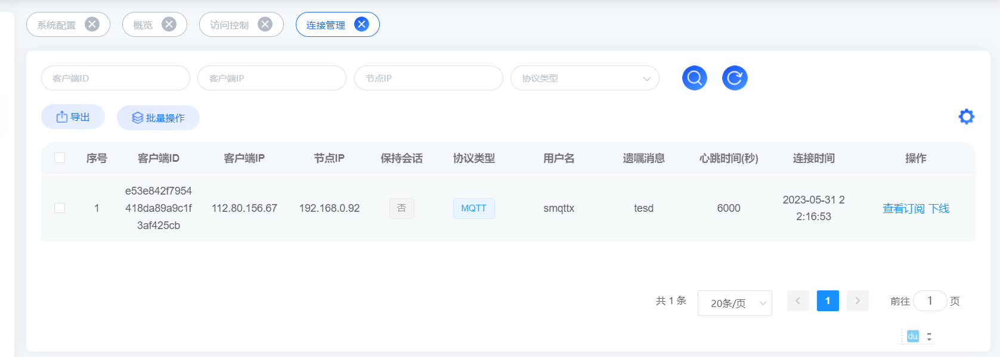

# 连接管理
连接管理是FluxMQ平台的基础功能模块，负责设备连接认证，连接管理，连接权限控制等；FluxMQ提供一个后台web控制台，用户可通过页面直接进行客户端的管理和控制。  

## 连接查询
连接查询支持通过客户端ID，客户端IP，节点IP和协议类型进行模糊搜索以对连接列表进行过滤；

| **查询字段**    | **说明**                                    |
|-------------|-------------------------------------------|
| 客户端ID      | 连接客户端的ID                                  |
| 客户端IP   | 连接客户端的IP                                  |
| 节点IP        | 所连接FluxMQ节点IP                             |
| 协议类型       | 协议类型  1. MQTT  2. WS  3.MQTTS |

## 连接剔除
> 用户可通过连接查询功能，对连接列表进行过滤，选择需要剔除的连接，点击剔除按钮，即可将该连接剔除。

## 连接信息导出
> 用户可通过连接查询功能，对连接列表进行过滤，选择需要导出的连接，点击导出按钮，即可将该连接信息导出。

> 导出的连接信息为csv格式，可通过excel打开查看。包含以下字段：
> - 客户端ID 
> - 客户端IP
> - 节点IP
> - 协议版本
> - KeepAlive时间
> - 认证信息
> - 遗嘱信息

