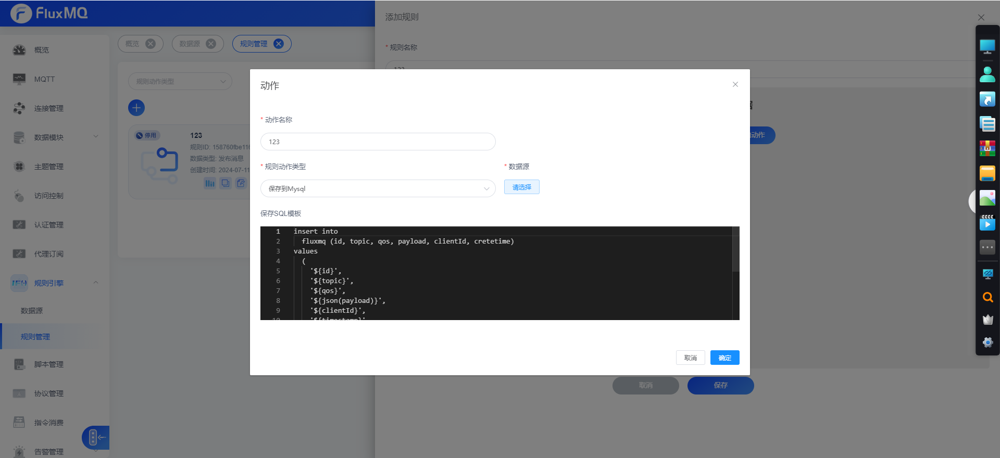

# 保存至mysql



##  Sql脚本
fluxmq新增mysql存储的时候默认提供插入的sql脚本,只需要根据对应的[数据类型](../rule/EVENT.md)数据格式，选择对应的占位符插入即可，

```sql
insert into
  fluxmq (id, topic, qos, payload, clientId, cretetime)
values
  (
    '${id}',
    '${topic}',
    '${qos}',
    '${json(payload)}',
    '${clientId}',
    '${timestamp}'
  )
```
## 批量设置
fluxmq提供批量插入数据库的操作，需要数据库开启批处理，默认提供2个参数设置

### 批量大小
批量数据缓存到指定大小后，会批量保存到数据库中 

### 批量间隔

批量数据缓存到达指定间隔时间后，会批量缓存到数据库中，默认设置单位`毫秒`

