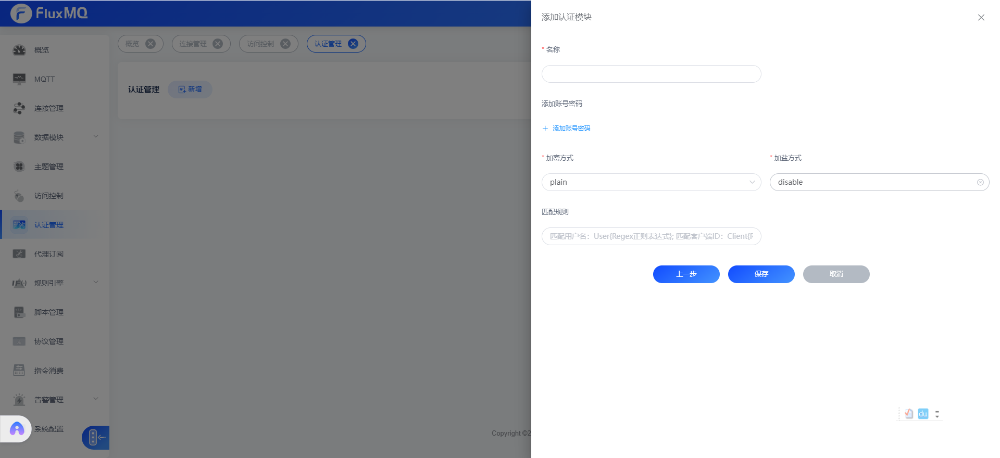

# 固定密码认证
> 固定密码认证是指所有客户端使用相同的密码进行认证，这种方式适用于客户端数量较少的场景，例如测试环境。
> 这种方式配置无法检验具体的客户端ID，生产环境慎重使用。

支持设置固定密码，以及盐用户对设备连接进行鉴权

## 加密

### 加密算法

> 加密后的`password`不区分大小写

| **加密方式** | **释义**   |
|----------|----------|
| plain    | 明文       |
| md5      | md5加密    |
| sha1      | sha1加密   |
| sha256     | sha256加密 |
| sha512     | sha512加密 |

### 盐

> 目前支持三种加盐策略

| **加盐策略** | **释义**           |
|----------|------------------|
| disable  | 不加盐              |
| prefix   | `salt`+`password`  |
| suffix   | `password` +`salt` |

## 认证规则

现在新增认证管理器支持正则匹配clientId,定向路由认证管理器,可以操作clientId、username,具体语法如下：
-  客户端ID匹配正则 `Client{regex}`
-  用户名匹配正则  `User{regex}`

如果不配置正则表达式，表示匹配所有，所有请求都将会走该认证管理器。

