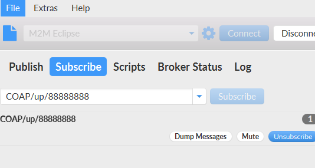
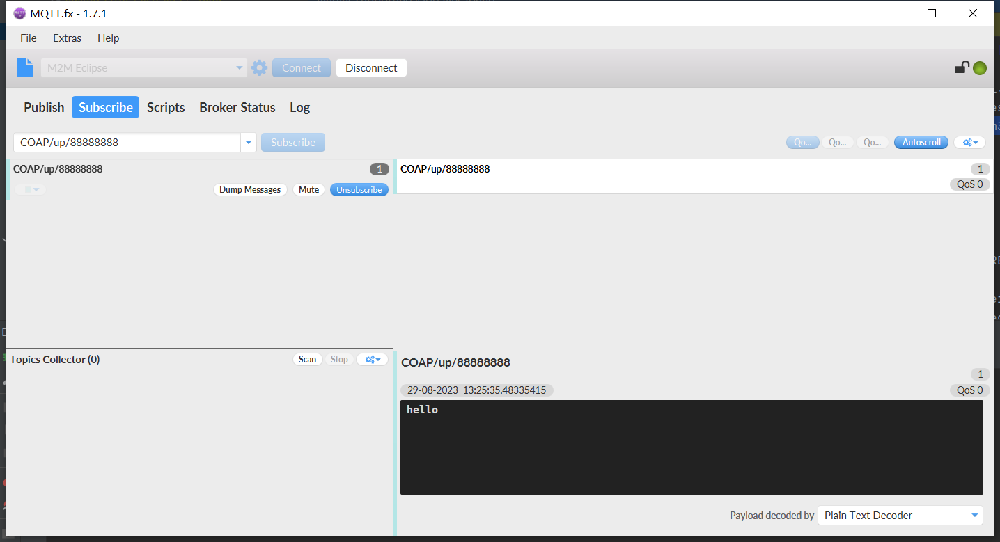

# COAP协议插件

> CoAP是一种轻量级的通信协议，全称为Constrained Application
> Protocol，意为“受限应用协议”。它是专门为受限设备（如传感器、执行器等）与互联网相连而设计的通信协议，可使这些设备在网络中进行低延迟、低带宽消耗的通信。CoAP基于UDP协议，具有很小的报文头部，易于实现和扩展。

FluxMQ目前COAP只支持上行，不支持下行，下行请使用MQTT协议。

## 上报消息

请求path：`coap://ip:port/mqtt/publish?clientId=clientId`
请求方法：`POST`

## 使用示例

### 使用Californium3创建客户端

```java 
        CoapClient client=new CoapClient("coap://localhost:5603/mqtt/publish?clientId=88888888");
        CoapResponse response=client.post("hello",MediaTypeRegistry.TEXT_PLAIN);  //发送post请求
        if(response!=null){
        System.out.println(response.getCode());  //打印请求状态码
        System.out.println(response.getOptions());  //选项参数
        System.out.println(response.getResponseText());  //获取内容文本信息
        System.out.println("\nAdvanced\n");    //
        System.out.println(Utils.prettyPrint(response));  //打印格式良好的输出
        }
```
### MQTT.FX订阅
> 订阅规则： 协议名称/up/{clientId}  



### 运行结果
