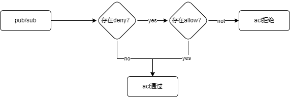

# ACL访问控制

ACL访问控制可以用来控制客户端的发布订阅权限，保证数据的安全传输。

## ACL拦截规则

当客户端建立连接后，会加载ACL缓存(默认60S定时刷新),客户端发布订阅后，会根据其主题匹配是否存在`deny`规则，如果不存在`deny`规则，则ACl检查通过
,如果存在Deny规则，再去检查是否存在`allow`规则,如果存在`allow`规则，acl检查通过，否则失败。

## ACL参数

| **配置项** | **释义**                                                                      |
|---------|-----------------------------------------------------------------------------|
| acl_strategy   | 控制策略:    allow 允许    deny 拒绝                                        |
| acl_type     | acl类型:    ip 客户端ip    clientId 客户端id   user 用户名   all 所有客户端 |
| acl_action    | acl动作K   publish 发布   subscribe 订阅      pubsub 发布订阅             |
| topic  | 主题TOPIC,支持通配符（# 多级;+ 单级），支持占位符( 客户端ID: `${clientId}`; 用户名: `${user}`)       |
| subject  | acl类型对应的acl实体内容                                                             |