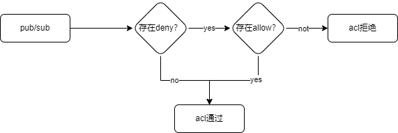

# HTTP配置方式


通过HTTP配置方式去加载ACL规则，当外部数据库ACL规则发生变化后，FluxMQ会定时去刷新ACL缓存，实现ACL缓存的热更新。

## ACL拦截规则


当客户端建立连接后，会加载ACL缓存(默认60S定时刷新),客户端发布订阅后，会根据其主题匹配是否存在`deny`规则，如果不存在`deny`
规则，则ACl检查通过
,如果存在Deny规则，再去检查是否存在`allow`规则,如果存在`allow`规则，acl检查通过，否则失败。

## 配置

| **配置项** | **释义**                                            |
|---------|---------------------------------------------------|
| 请求地址    | 请求acl的配置的地址                                       |
| 请求方法    | 默认只支持`POST`请求                                     |
| 请求参数    | 默认不携带参数，用户可以配置固定参数作为请求Body，传输使用`application/json` |
| header  | 默认不携带header                                       |
| 加载周期    | 定时去数据库刷新ACL缓存                                     |

## 返回参数

> 必须按照以下格式以及字段返回参数

```JSON
[
  {
    "acl_strategy": "allow",
    "acl_type": "all",
    "acl_action": "publish",
    "topic": "test/test/#",
    "subject": "*"
  },
  {
    "acl_strategy": "allow",
    "acl_type": "ip",
    "acl_action": "publish",
    "topic": "test/test/#",
    "subject": "192.168.10.111"
  }
]
```

具体字段配置请查看 [ACL介绍](before)
