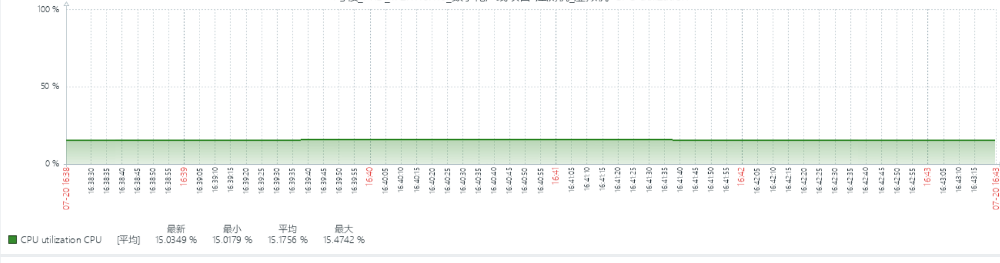
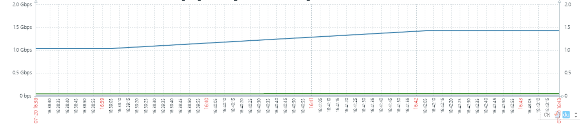
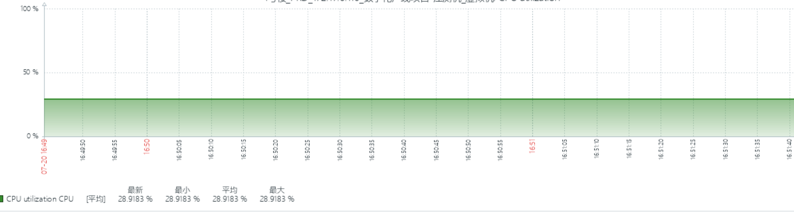
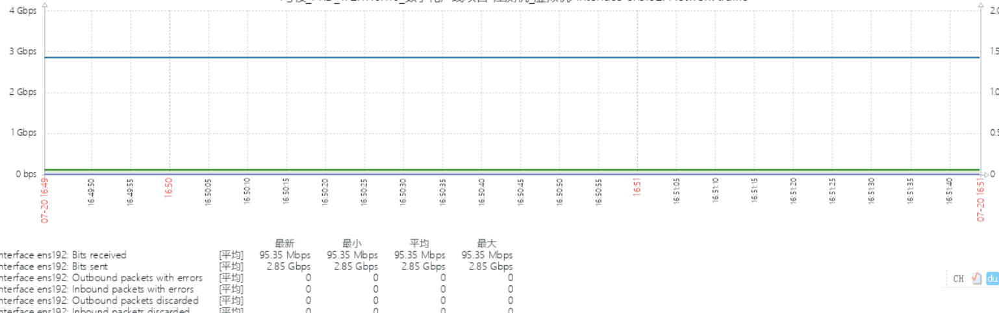

# 单Topic压测

### 压测准备 - 使用emqtt-bench压测工具
>https://github.com/emqx/emqtt-bench

发布脚本
```
./emqtt_bench pub -t test  -h 172.17.6.75   -p 1887 -u fluxmq -P fluxmq -s 1024 -q 0 -c 1 -I 1000  -i 2 -L 1000000
```

订阅脚本
```
./emqtt_bench sub -t test  -h 172.17.6.75   -p 1887 -u fluxmq -P fluxmq -c 50000  -i 2 -q 0
```

### 压测指标

<div class="table-1">

|      压测目标(CPU使用率)       | FluxMQ | BifrMQ | EMQX | HiveMQ |
|:-----------------------:|:------:|:------:|:----:|:------:|
| only_2_5W_0_1_1024_1000 |  15%   |  16%   | 19%  |  41%   |
| only_4_5W_0_1_1024_1000 |  28%   |  30%   | 35%  |  82%   |

</div>

### 压测明细
>连接数_订阅数_QOS_频率(每秒)_数据包大小_数据包总数

> only_2_5W_0_1_1024_1000




> only_4_5W_0_1_1024_1000



