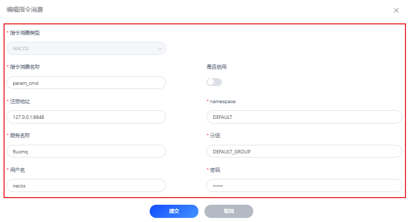

# Nacos推送指令

## 场景说明
指令下发，基于Nacos节点内部使用的事件机制进行通信，这样各种操作进行了解耦，提高了性能。

本示例演示：通过Nacos精准推送指令消息。

## 前提条件
- 拥有可使用的Nacos实例

## 配置转发规则
### 1. 选择左侧导航栏的“指令消费”，单击左上角的“+”来新建指令消费配置。

### 2. 配置界面参考下表参数说明，填写相关内容。以下参数取值仅为示例，填写完成后单击“提交”。

#### 编辑指令消费
| **参数名**    | **参数说明**                       |
|------------|--------------------------------|
| 指令消费类型     | 默认，如：Nacos                     |
| 指令消费名称     | 指令消费实例名，如：param_cmd            |
| 注册地址       | Nacos注册地址，如：127.0.0.1:8848     |
| namespace  | Nacos配置namespace名，默认：DEFAULT   |
| 服务名称       | 在Nacos注册的服务名，如：fluxmq          |
| 分组         | namespace下的分组，默认：DEFAULT_GROUP |
| 用户名        | 访问Nacos的用户名                    |
| 密码         | 访问Nacos的密码                     |

3. 管理指令消费实例，可以通过看板界面继续编辑、启停用、删除操作
