# 认证管理  
身份认证是大多数应用的重要组成部分，MQTT 协议支持用户名密码认证，启用身份认证能有效阻止非法客户端的连接。

## 密码认证
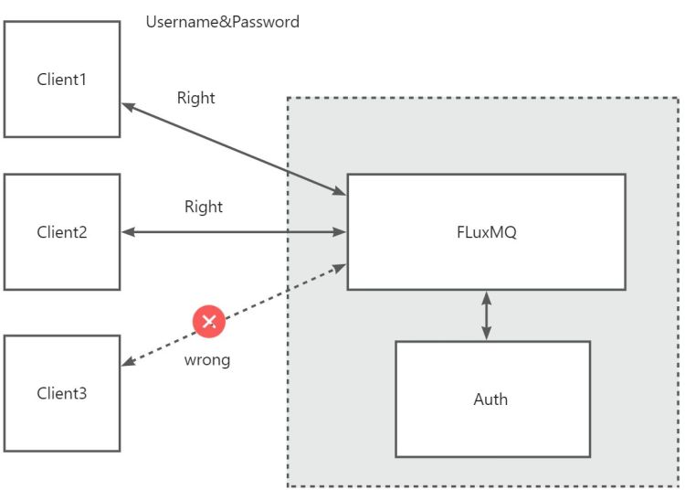
> 连接客户端需提供username和password，才能连接平台，否则平台会拒绝非法连接。
认证的实体为:
```json
{
  "clientId": "TEST",
  "username": "admin",
  "password": "admin"
}
 
```
下面FluxMQ提供三种认证方式，可根据实际情况选择合适的认证方式。WEB控制台默认匿名形式，即不进行认证。
配置在系统设置中，如下图所示：
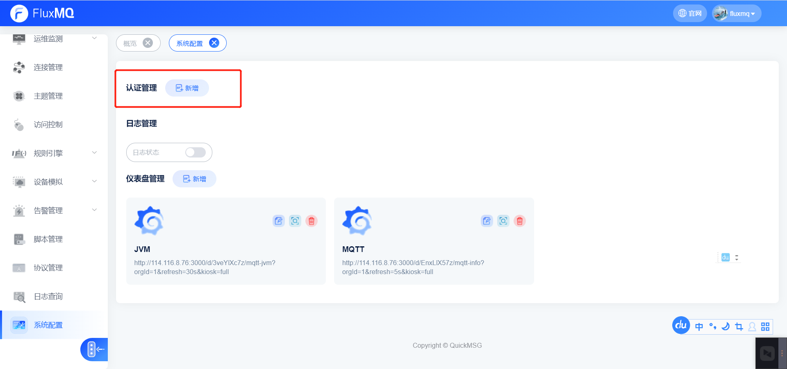
### 固定密码认证
> 固定密码认证是指所有客户端使用相同的密码进行认证，这种方式适用于客户端数量较少的场景，例如测试环境。
> 这种方式配置无法检验具体的客户端ID，生产环境慎重使用。
1. 选择固定密码认证方式
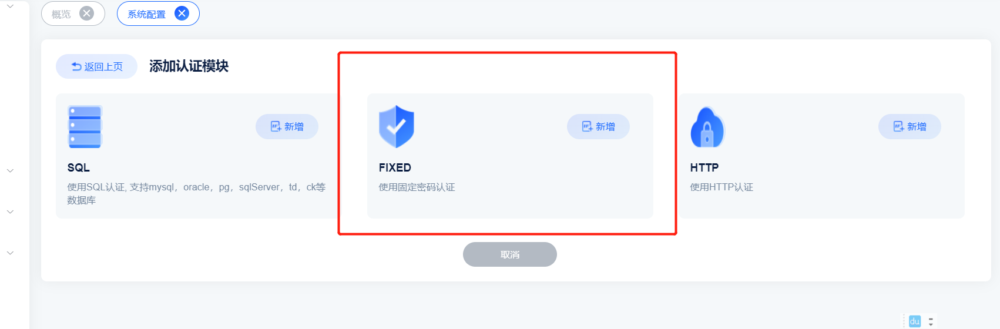
2. 设置固定密码
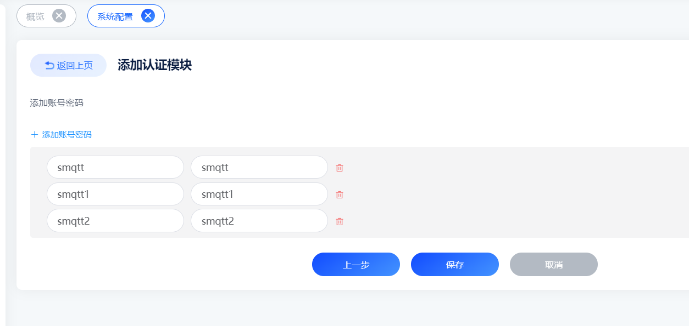
3. 保存后，启动认证服务 
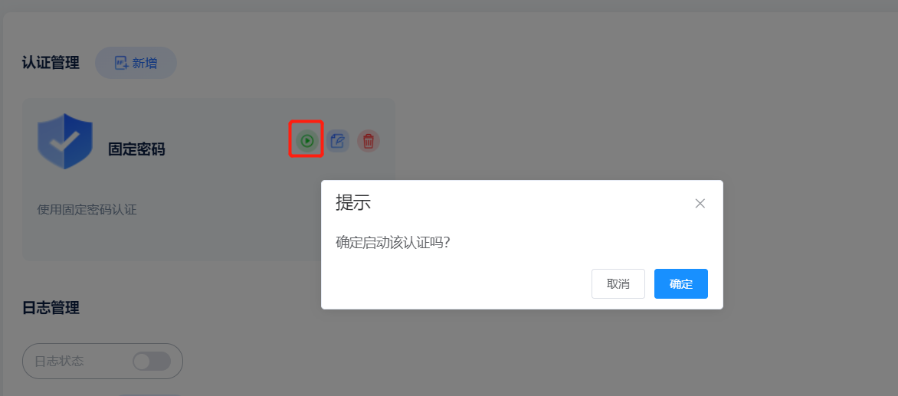
4. 客户端连接时，需提供相同的用户名和密码，否则连接失败

### HTTP认证
> HTTP认证是指客户端连接时，通过HTTP接口进行认证，这种方式适用于客户端数量较多的场景，例如生产环境。
> 默认只支持POST请求，请求Content-Type为application/json，请求体为上述认证实体。 HTTP认证返回状态码为200时，认证成功，否则认证失败。
1. 选择HTTP认证方式
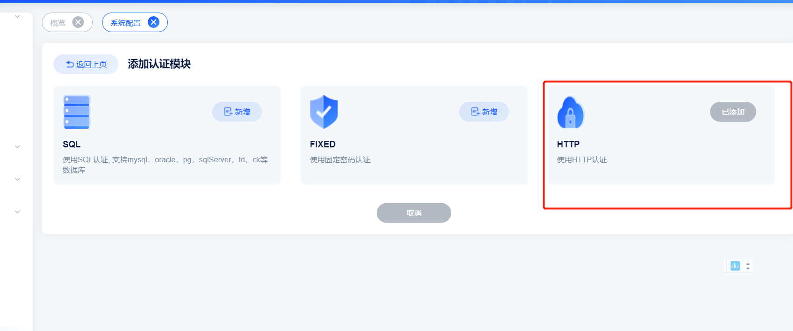
2. 设置HTTP认证地址
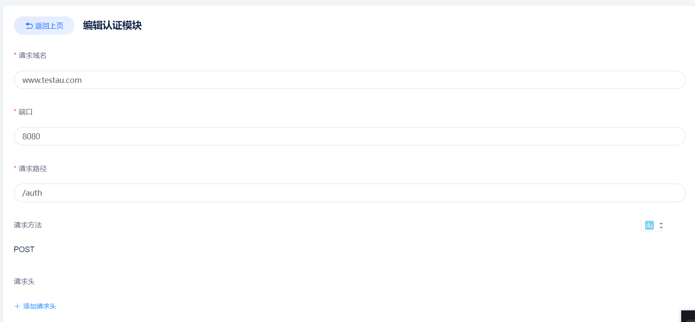
3. 保存后，启动认证服务
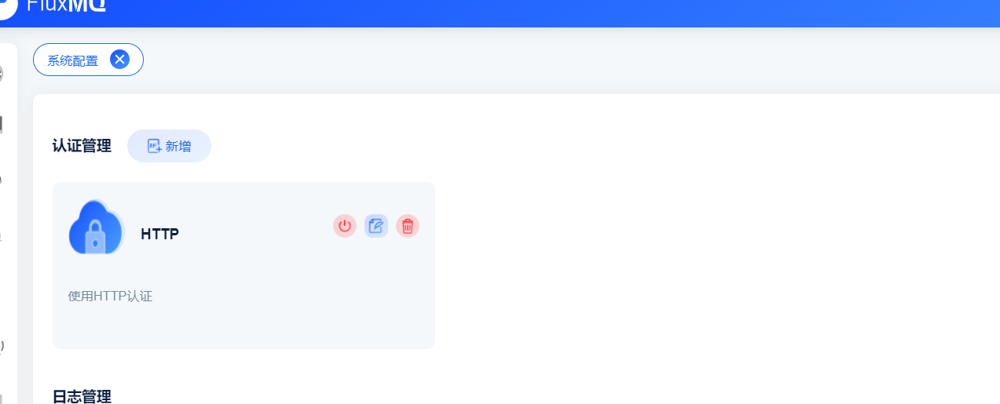

### SQL认证
> SQL认证是指客户端连接时，通过SQL语句进行认证，这种方式适用于客户端数量较多的场景，例如生产环境。

1. 选择SQL认证方式
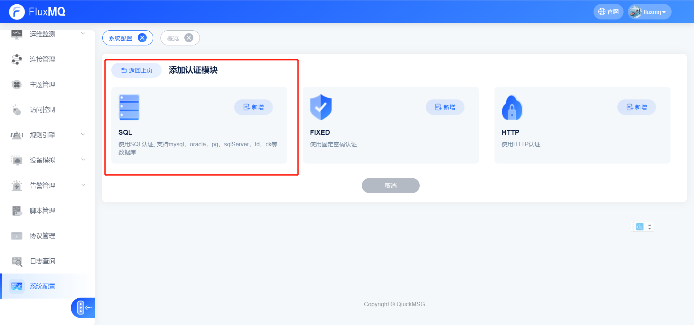
2. 设置SQL认证地址
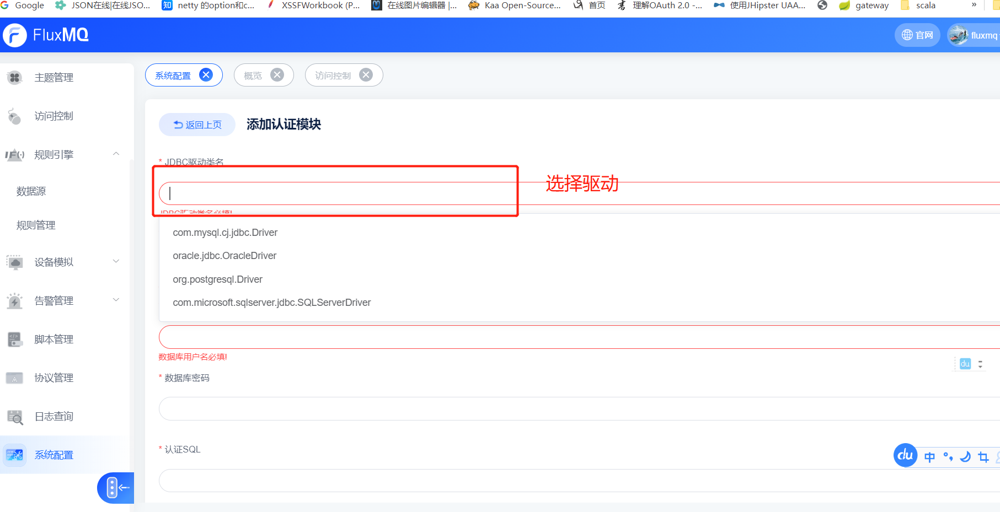
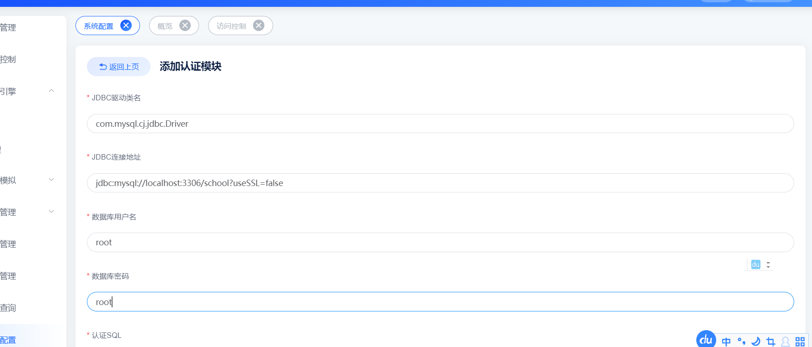
3. 设置SQL认证语句
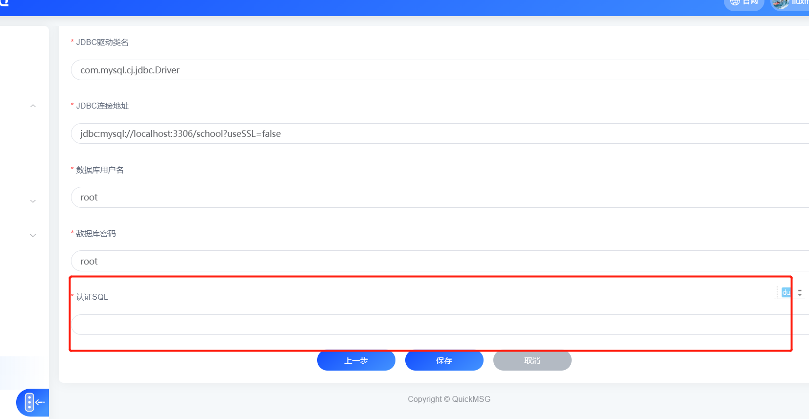

> 使用 ${认证实体变量名}去引用认证实体中的属性，例如：${username} 代表认证实体中的username属性。
```sql
select count(1) from user where username = '${username}' and password = '${password}' and clientId = '${clientId}'
```
4. 保存后，启动认证服务
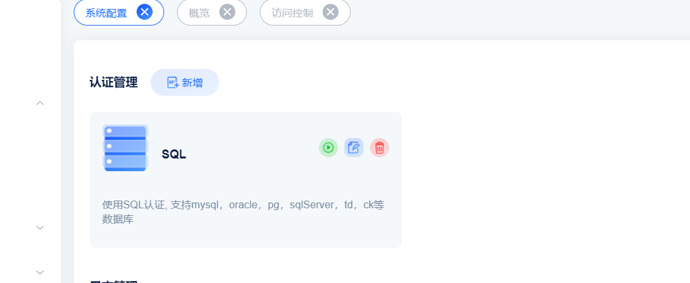


