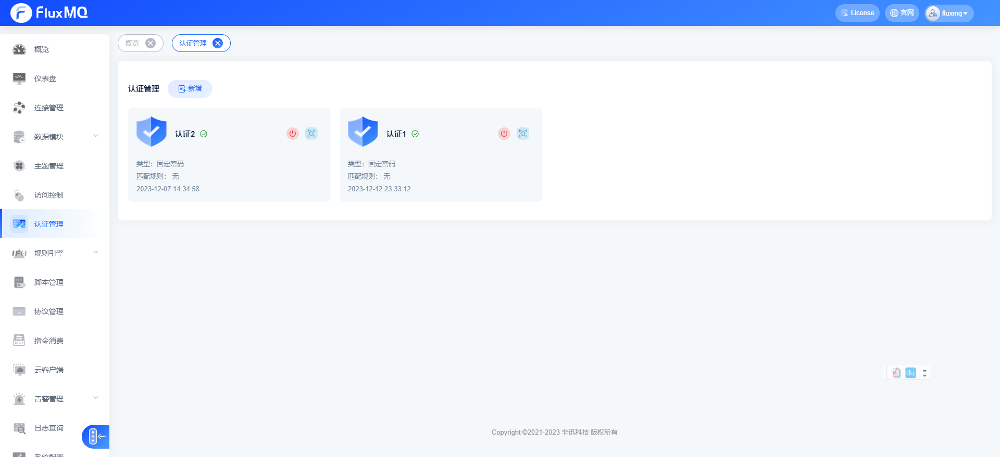
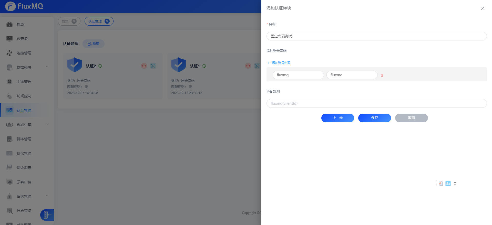
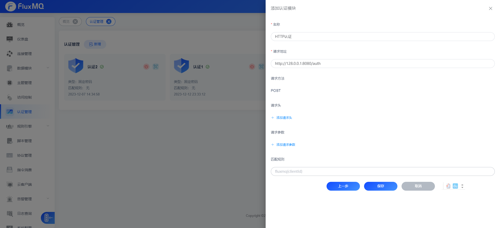
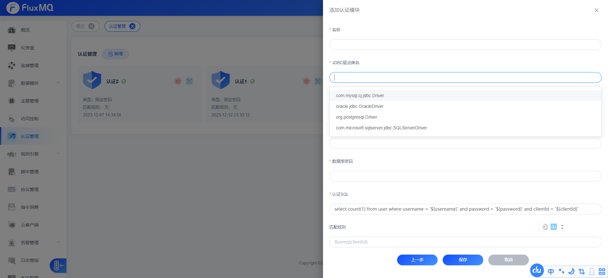

# 认证管理  
身份认证是大多数应用的重要组成部分，MQTT 协议支持用户名密码认证，启用身份认证能有效阻止非法客户端的连接。FluxMQ支持配配置多个认证方式，当配置多认证时候，连接会依次尝试认证，只要有一种认证方式通过即可连接成功。



现在新增认证管理器支持正则匹配clientId,定向路由认证管理器,可以操作clientId、username,具体语法如下：
-  客户端ID匹配正则 `Client{regex}`
-  用户名匹配正则  `User{regex}`

如果不配置正则表达式，表示匹配所有，所有请求都将会走该认证管理器。

### 固定密码认证
> 固定密码认证是指所有客户端使用相同的密码进行认证，这种方式适用于客户端数量较少的场景，例如测试环境。
> 这种方式配置无法检验具体的客户端ID，生产环境慎重使用。




### HTTP认证
> HTTP认证是指客户端连接时，通过HTTP接口进行认证，这种方式适用于客户端数量较多的场景，例如生产环境。
> 默认只支持POST请求，请求Content-Type为application/json，请求体为上述认证实体。 HTTP认证返回状态码为200时，认证成功，否则认证失败。




### SQL认证
> SQL认证是指客户端连接时，通过SQL语句进行认证，这种方式适用于客户端数量较多的场景，例如生产环境。

#### 选择对应数据驱动
> FluxMQ支持Mysql、PostgreSQL、Oracle、SQLServer等数据库，选择对应的数据驱动。


#### 配置认证SQL   
> 使用 ${认证实体变量名}去引用认证实体中的属性，例如：${username} 代表认证实体中的username属性。查询只要存在记录就认证成功，否则认证失败。

```sql
select count(1) from fluxmq where username = '${username}' and password = '${password}' and clientId = '${clientId}'
 ```


