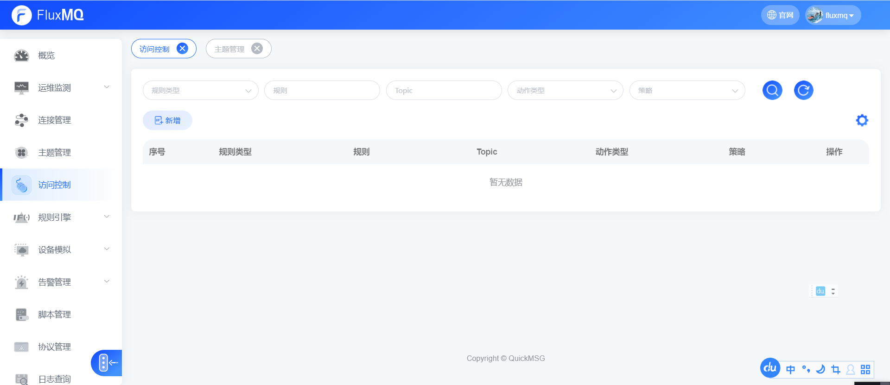
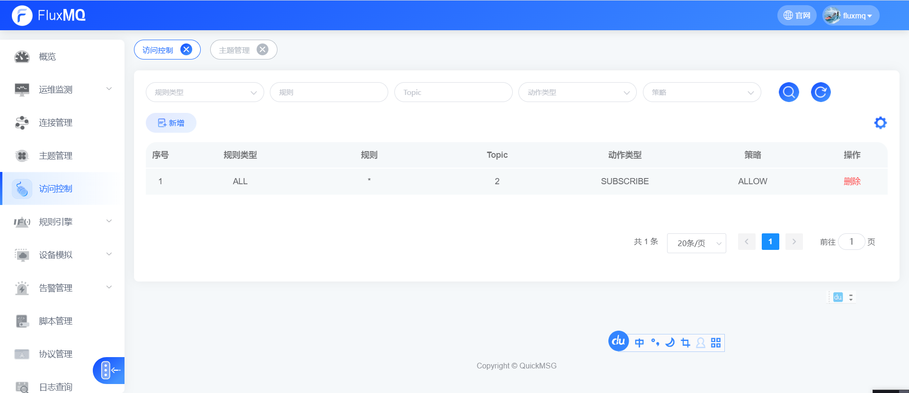
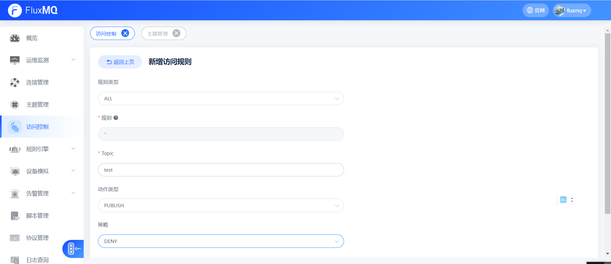
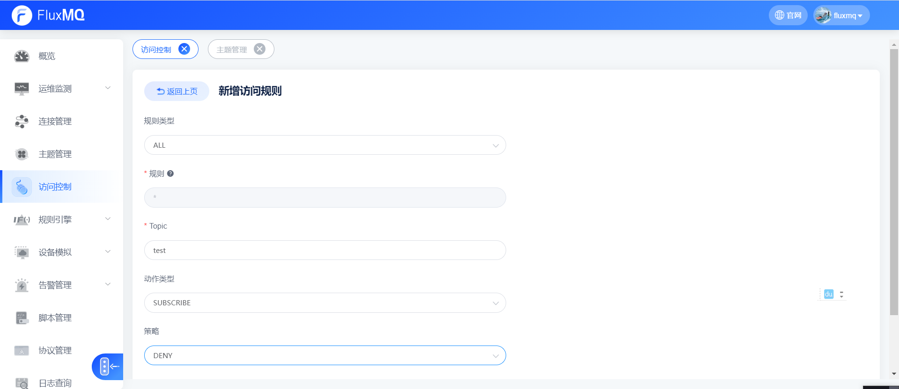
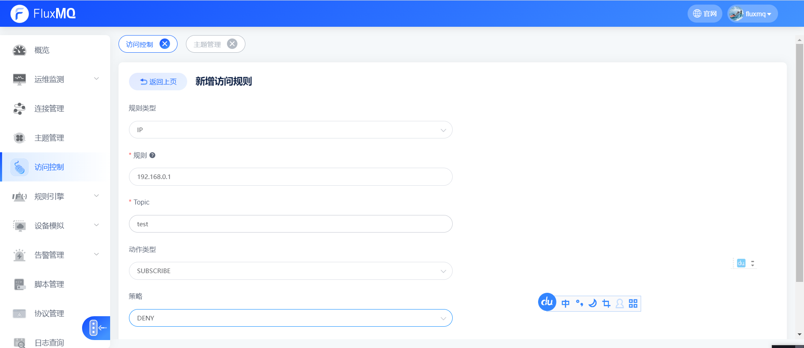
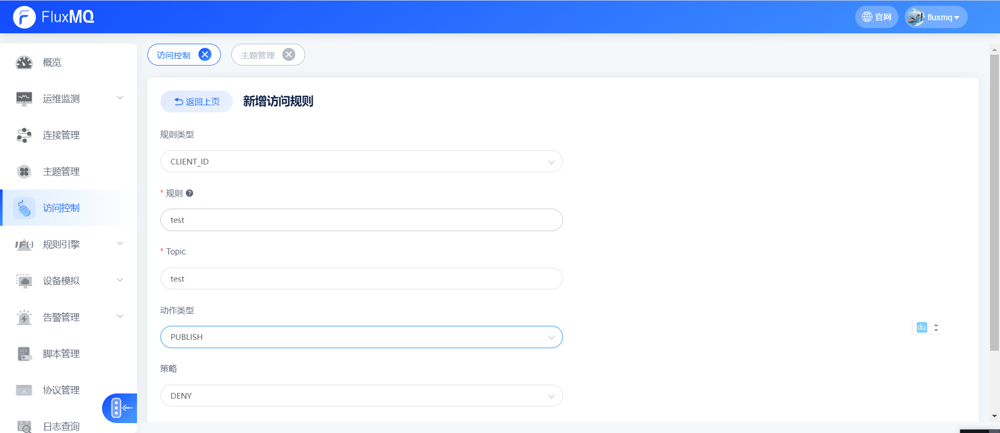
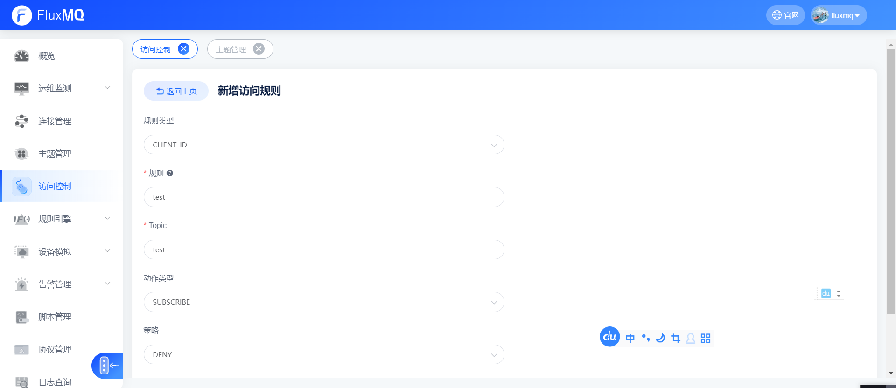
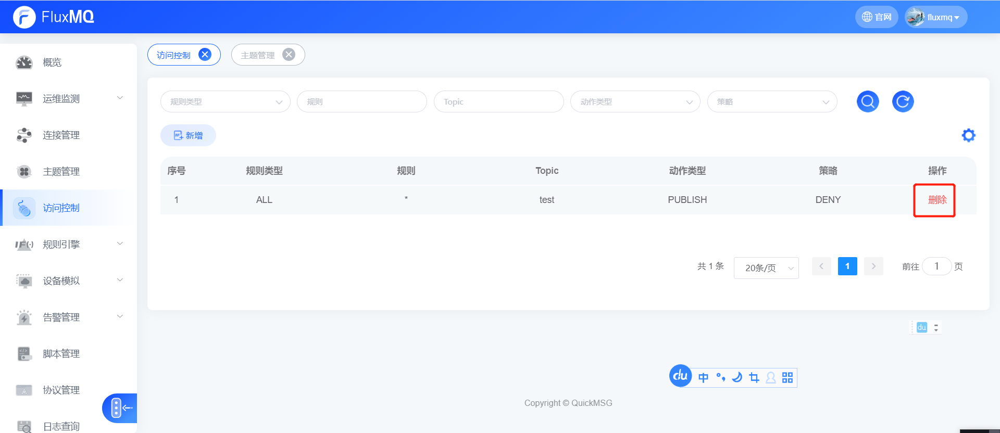

# 访问控制
访问控制是对发布订阅的ACL的权限控制，例如拒绝某个用户向某个主题发布消息；
主要规则说明：

## 访问控制查询

| **查询字段** | **说明**                                                                       |
|----------|------------------------------------------------------------------------------|
| 规则类型     |  1. ALL(所有)  2. IP(IP规则)  3. CLIENTID(客户端ID)    4. USER(用户名) |
| topic    | 限制TOPIC                                                                      |
| 规则       | 规则类容                                                                         |
| 动作类型     |  1. PUBLISH(发布)  2. SUBSCRIBE(订阅)                                    |
| 策略       |  1. ALLOW(允许)  2. DENY(禁止)                                           |

## 访问控制添加

### 所有禁止

#### 禁止所有客户端发布topic为test的消息

#### 禁止所有客户端订阅topic为test的消息

### IP禁止

#### 禁止ip为192.168.0.1发布topic为test的消息

#### 禁止ip为192.168.0.1订阅topic为test的消息

### 客户端ID禁止
#### 禁止客户端Id为test发布topic为test的消息

#### 禁止客户端Id为test订阅topic为test的消息

### 用户名禁止
#### 禁止用户名为user发布topic为test的消息

#### 禁止用户名为user订阅topic为test的消息

## 访问控制删除

