# 设备模拟功能
> FluxMQ提供了一些Web简易版本的设备模拟功能，方便用户进行设备模拟测试，用户可通过设备模拟功能，模拟设备连接，发布消息，订阅消息等操作。
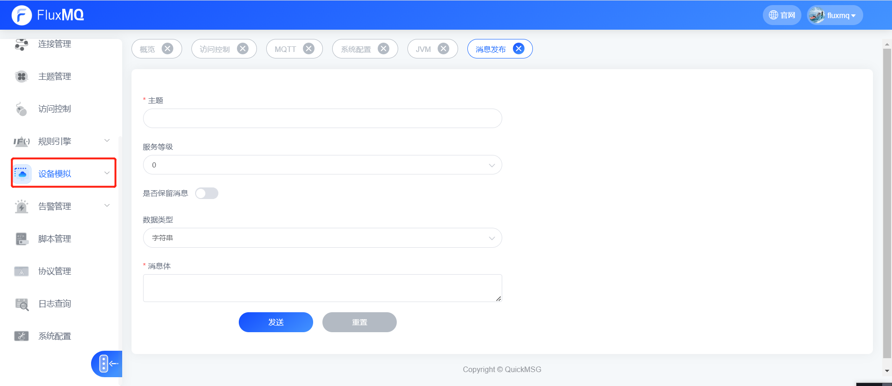

## 消息发布
> 提供给集群内的设备直接发布消息，支持选择topic，QoS，Retain等参数。
> 发布文本选择编码格式，支持字符串、json、Hex等编码格式。
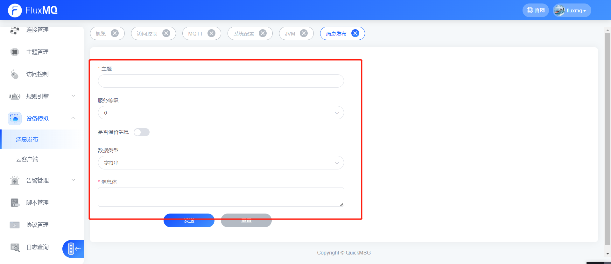

## 云客户端
> 云客户端提供基于Websocket over MQTT 进行模拟设备连接，用户可通过云客户端，模拟设备连接，发布消息，订阅消息等操作。
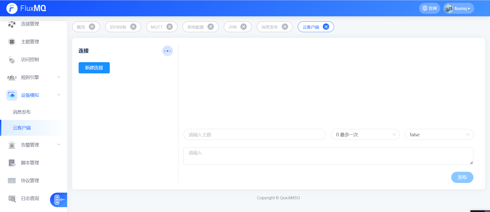

### 新建连接
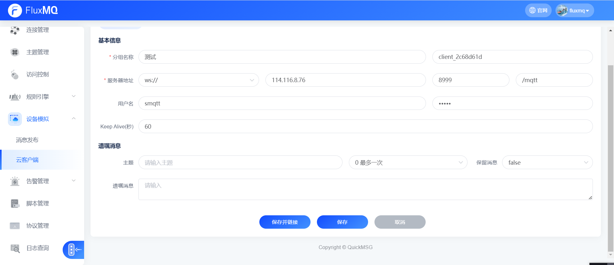

### 添加订阅
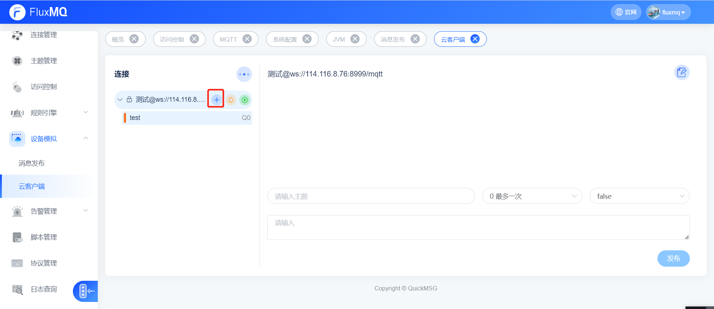
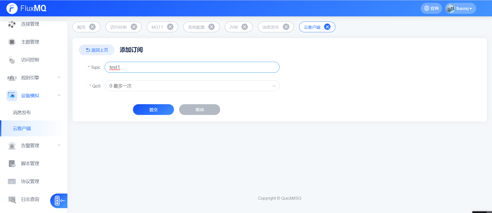
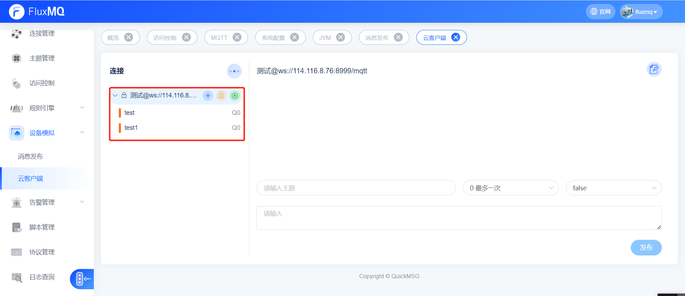

### 取消订阅
> 选择要操作的Topic 右击选择删除即可
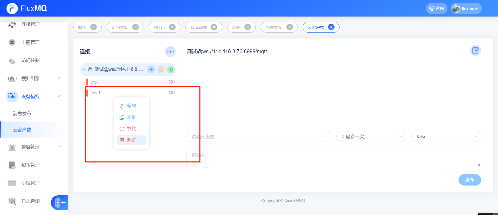
### 发布消息
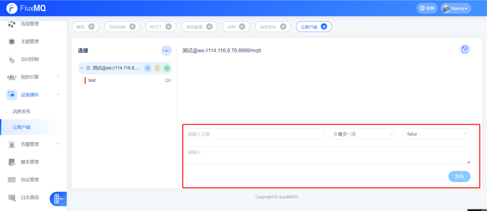

### 取消连接
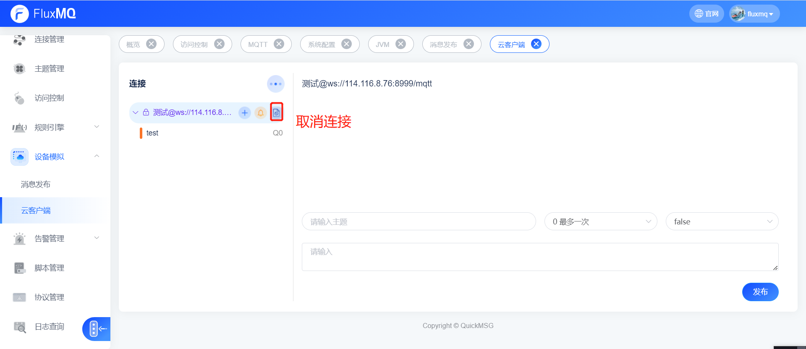
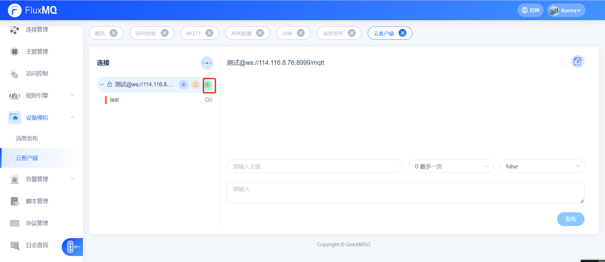
    