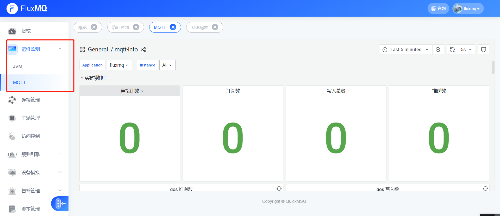
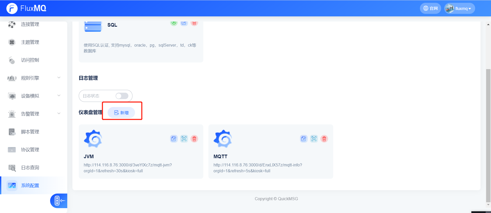
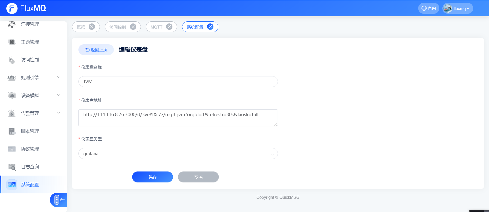
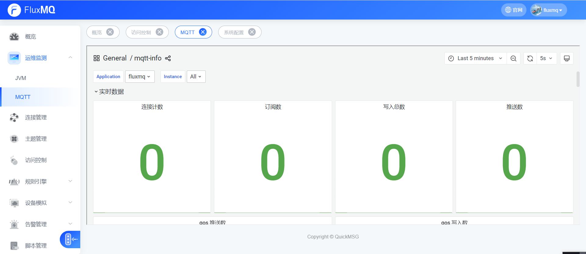
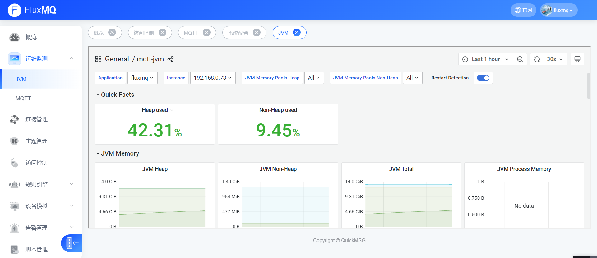

# 运维监控

平台运维监测主要采用集成第三方组件进行展示和通知（Granfna+Prometheus）；直观可视化的展示MQTT和JVM监测（java技术关键监测内容）；当服务器等出现异常时会及时通过用户，做出风险应对措施。

## 添加运维监控画板
> 系统设置->运维监控->仪表盘管理->添加仪表盘

选择仪表盘类型,Grafana地址
 

保存仪表盘后刷新页面，即可看到表单新增运维监控，点击进入即可查看监控数据

## FluxMQ提高的系统监控画板
> 默认的画板Json联系管理员获取

### MQTT监控

### JVM监控

