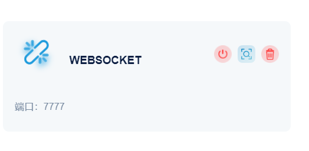
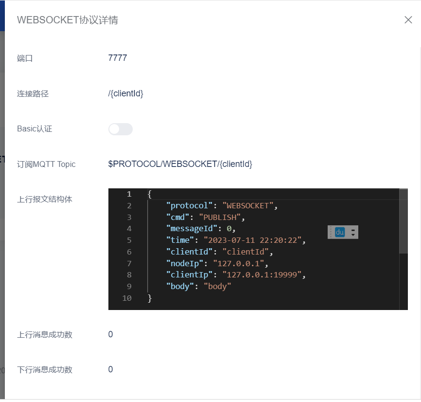
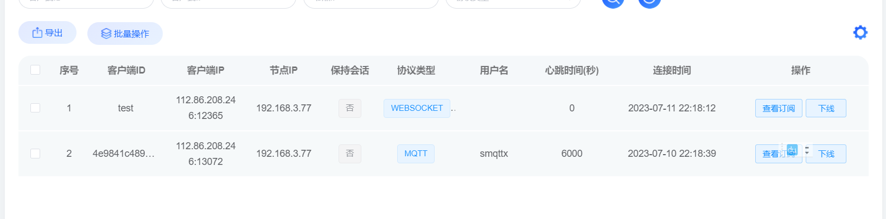
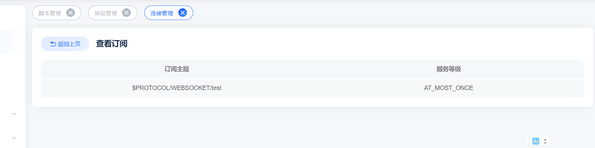

# 多协议模块
> 目前FluxMQ内置了COAP、WEBSOCKET、I1协议的组件，可以指定端口启动，启动后，可以通过MQTT与协议组件之间交互。每个客户端必须按照FluxMQ的标准进行接入。扩展协议与FluxMQ的MQTT共享以下组件：

- 认证模块
- 规则引擎
- 连接管理
- 日志管理
- 监控管理

### 上行指令
> 通过规则引擎配置选择扩展协议数据类型

`select * from "$EVENT.EXTENSION WHERE protocol = 'I1' "`

传输的数据格式如下：

```
{
    "protocol": "I1",
    "cmd": "PUBLISH",
    "messageId": 0,
    "time": "2023-07-11 21:59:23",
    "clientId": "clientId",
    "nodeIp": "127.0.0.1",
    "clientIp": "127.0.0.1:19999",
    "body": "body"
}
```
| 字段 | 说明 |
| --- | --- |
| protocol |  协议名称|
| cmd | 指令类型 <br> - PUBLISH 推送消息  <br> - CONNECT 连接 <br> - CLOSE 断开  |
| messageId | 消息id |
| time | 时间 |
| clientIp | 客户端地址|
| nodeIp |所在集群节点IP|
| body |报文，如果传输是JSON会自动转成JSON格式，否则统一UTF8字符串处理 |

#### 新增一个转发WEBSOCKET协议的报文
SQL如下：
```
select * from "$EVENT.EXTENSION WHERE protocol='WEBSOCKET'"
```
#### 新增一个转发WEBSOCKET 上报协议的报文
SQL如下：
```
select * from "$EVENT.EXTENSION WHERE protocol='WEBSOCKET' AND cmd ='PUBLISH'
```


### 下行指令
通过MQTT客户端下发FluxMQ集群指令，即可将指令写给扩展协议客户端，格式如下：
```
$PROTOCOL/协议名称/{clientId}
```
### 连接管理
#### 启动WEBSOCKET协议插件


#### WEBSOCKET客户端连接
```
ws://123.249.9.130:7777/test
```
#### 连接管理


