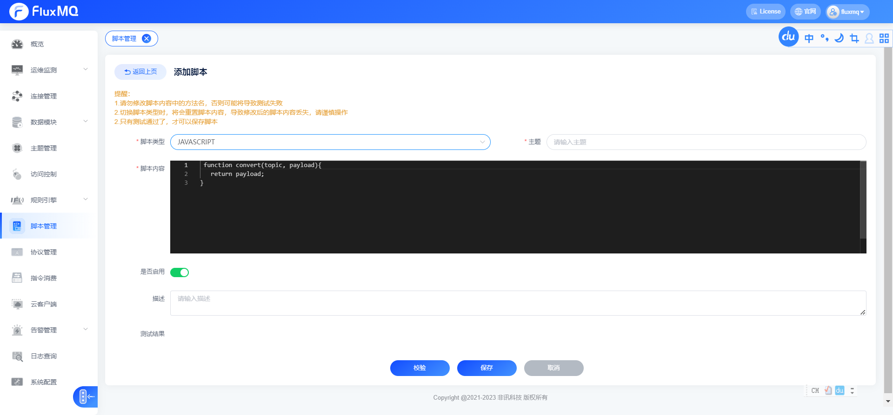
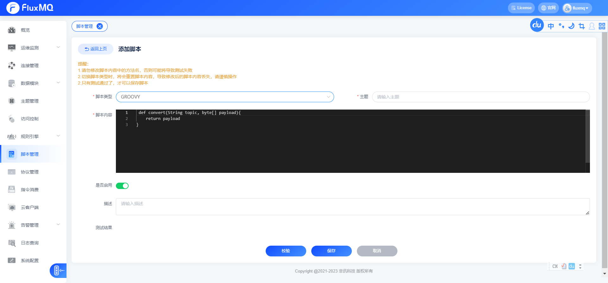

# 脚本管理

FluxMQ支持脚本来处理数据流，可以将MQTT传输的Payload转换成任意格式，再流转到后续的规则引擎中，但是脚本中的方法尽量保持轻量、高效，避免出现阻塞Pipeline的情况。导致系统性能下降

## 在payload的json数据中，添加一个额外的字段
## JS脚本

```javascript
 function convert(topic, payload){
    var jsonString = JSON.stringify(payload);
    var jsonObject = JSON.parse(jsonString);
    jsonObject["additionalField"]="js";
    return JSON.stringify(jsonObject);
}
```

## Groovy脚本

```groovy
import groovy.json.JsonSlurper
import groovy.json.JsonOutput
String  convert(String topic, byte[] payload){
    def jsonString = new String(payload, "UTF-8")
    def jsonObject = new JsonSlurper().parseText(jsonString)
    jsonObject.put("additionalField", "additionalField")
    return JsonOutput.toJson(jsonObject)
}
```

## Lua脚本

```javascript
function convert(topic, payload){
    return payload;
}
```


