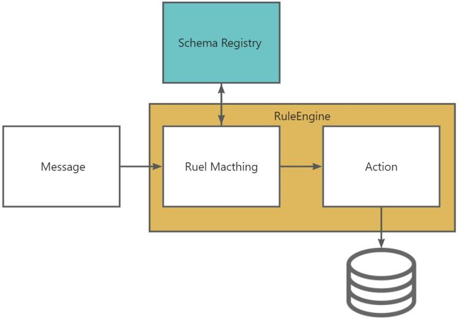
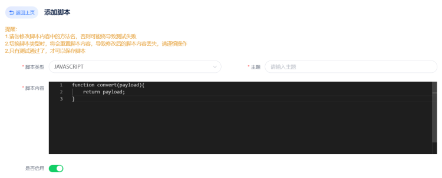

# 编解码

> 物联网中的编解码通常是指将传感器或设备生成的数据转换为计算机可以理解和处理的格式，或将计算机生成的数据转换为传感器或设备可以理解和处理的格式。

平台支持的编解码方式有

| **协议类型** | **说明** |
| --- | --- |
| MQTT直连 | 适用于轻量级的异步通信。设备通过MQTT协议接入服务网关，通过Topic发布和订阅消息。 |
| WebSocket | 适用于设备端和服务端进行双向数据传输的场景。设备通过Websocket接入。 |
| CoAP | 适用于资源受限的低功耗设备。设备通过Topic订阅和发布消息。 |
| TCP透传 | 适用于可靠性高的场景。设备使用TCP协议连接服务并传输消息。 |
| HTTP推送 | 适用于设备使用HTTP协议上报消息的场景。 |
| UDP | 适用于速度要求高的场景。设备使用UDP协议连接服务并传输消息。 |
| MQTT Broker | 适用于设备不直接接入平台，而是通过第三方MQTT服务接入的场景。 |

### 编解码与规则引擎

### 脚本管理

