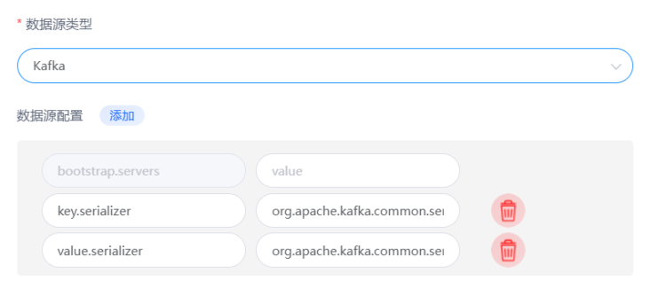
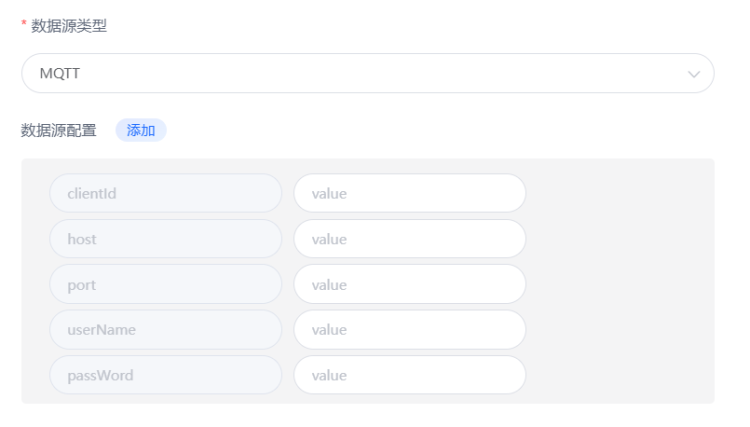
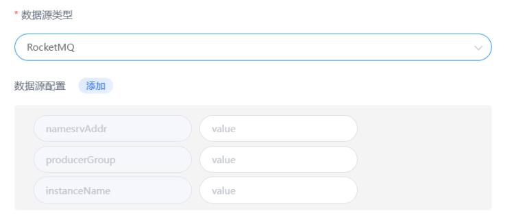
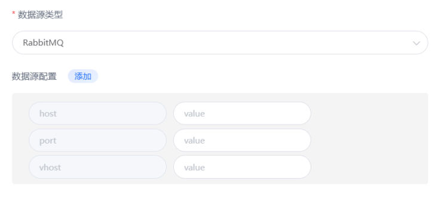
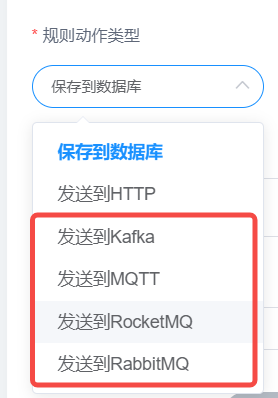

# 数据桥接
数据桥接是指将来自不同源的物联网设备数据进行整合、转换、处理、传递等操作，使得这些数据能够在一个统一的平台上进行分析、存储和管理。
目前FLuxMQ支持桥接Kafka， Pulsar，RabbitMQ，RocketMQ等主流企业应用消息中间件。
具体设置如下：
## 创建数据源
### 创建Kafka数据源

### 创建MQTT数据源

### 创建RocketMQ数据源

### 创建RabbitMQ数据源

## 在规则管理创建响应动作
选择对应动作类型和该类型对应数据源  

