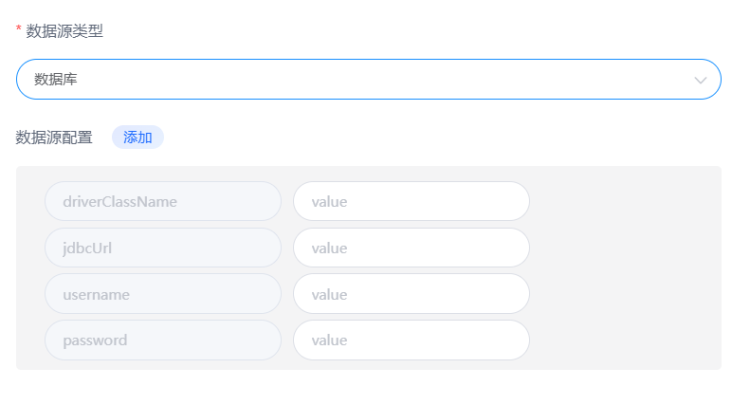
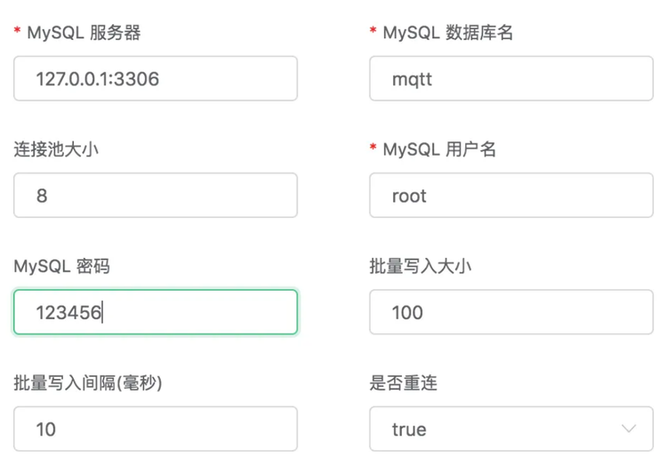
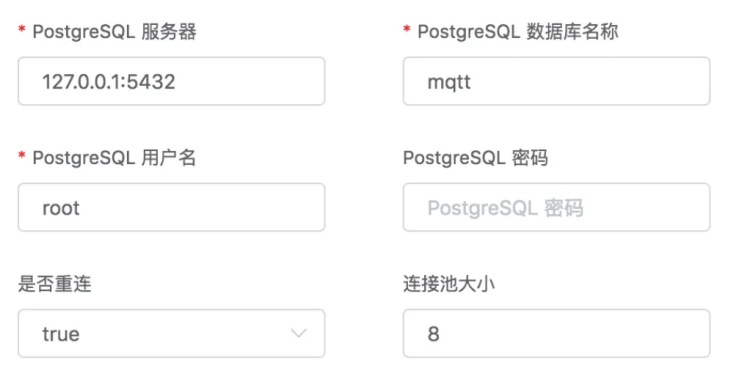
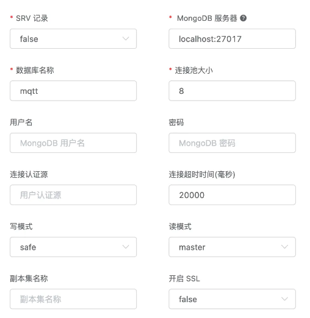
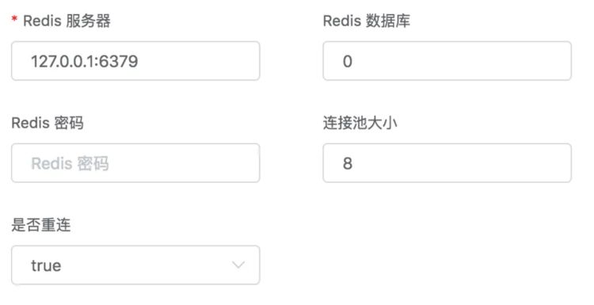
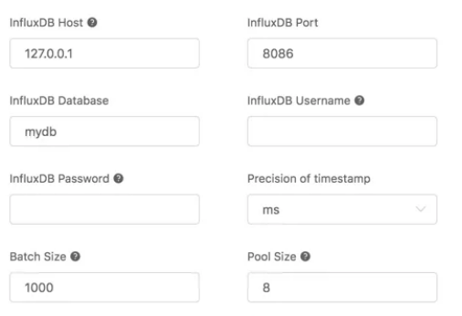
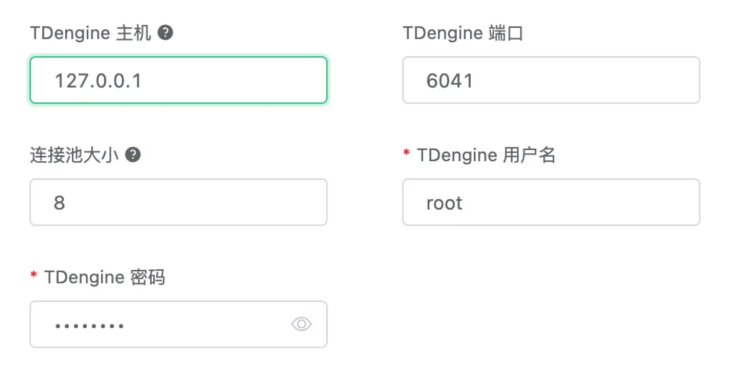

# 数据存储
FluxMQ支持多种数据库的持久化；包括MySQL， PostgreSQL等关系型数据库; TDengine，InfluxDB等实时数据库，MongoDB，Redis，ClickHouse等非关系型数据库。
### 通用数据库配置

### Mysql配置选项

### PostgreSQL配置选项

### MongoDB配置选项

### Redis配置选项

### ClickHouse配置选项

### InfluxDB配置选项

### TDengine配置选项

