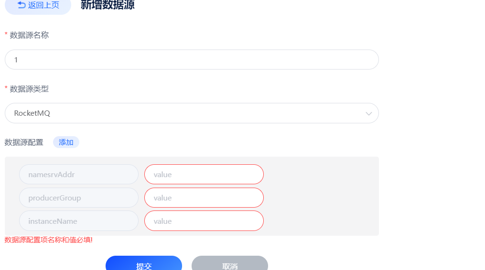

# 数据存储
FluxMQ支持多种数据库的持久化；包括MySQL， PostgreSQL等关系型数据库; TDengine，InfluxDB等实时数据库，MongoDB，Redis，ClickHouse等非关系型数据库。
### 通用数据库配置

### KAFKA数据库配置

### RabbitMQ数据库配置

### RocketMQ数据库配置

### Redis数据库配置

### HTTP数据库配置

### MQTT数据库配置

