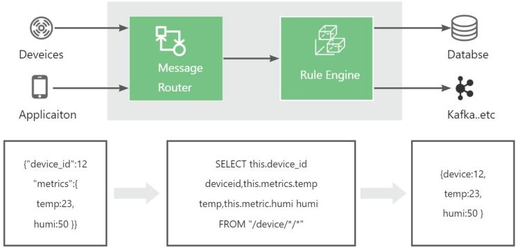

# 规则引擎介绍

## 简介
FluxMQ的Rule Engine(简称规则引擎)允许开发人员定义、管理和自动执行物联网设备数据移动和业务逻辑。该规则引擎使用条件语句、规则和触发器来实现；提升用户易用性，降低与业务系统的耦合度。

天晴物联在消息发布或事件触发时将触发规则引擎，满足触发条件将执行各自的SQL规则处理和执行操作；

## 规则引擎典型应用场景
**数据转发**：工业应用对数据的需求不同，且各领域数据之间具有一定的安全和数据权限管控要求，需要将实时数据进行桥接转发各自主题。（如转发生产应用，研发应用，行政应用等）；  
**数据筛选**：设备运行时会产生大量的数据，如设备启动，真正进入某个批次生产时，数据才是业务系统关注；此场景下可以使用规则引擎对批次信息进行条件过滤，向业务消息队列写入批次生产的数据；  
**消息编解码**：充电桩等行业应为私有化TCP协议接入，需要通过规则引擎进行函数处理，做二进制或特殊格式消息体的编解码工作。以保证数据能够解码成标准的数据格式；  
**报警通知**：当运行设备超过数值时，或因为其他原因关机或离线，使用规则引擎配置监听离线和报警服务，推送该故障信息到业务系统，以保证业务人员可以第一时间进行处理。  
