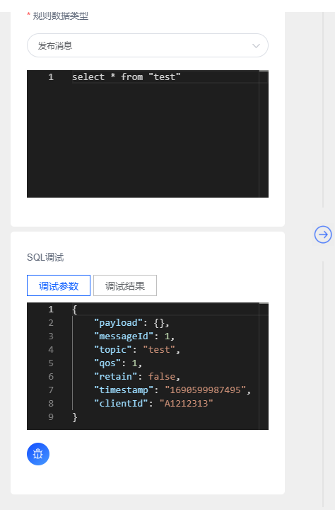

# 规则引擎语法
创建数据转发规则时，需要编写SQL来解析和处理设备上报的JSON数据。本文主要介绍如何编写数据转发规则的SQL表达式。
## SQL语法

SQL语句由SELECT子句和WHERE子句组成，每个子句不能大于500个字符。SELECT子句和WHERE子句里的内容大小写敏感，SELECT和WHERE，AS等关键字大小写不敏感。
以设备消息上报为SQL源数据示例:

```
{
    "payload": {
      "temperature" : 40,
      "humidity" : 24
    },
    "messageId": 1,
    "topic": "test",
    "qos": 1,
    "retain": false,
    "time": "2022 12-22 12:00:00",
    "clientId": "A1212313"
}
```

### 使用案例
> 当payload数据是Json字符串时候,FluxMQ可以通过SQL中:  `payload.<KEY>` 方式获取某一个值

| **功能**                                                          | **SQL**                                                       |
|-----------------------------------------------------------------|---------------------------------------------------------------|
| 获取Topic订阅匹配`test/#`所有消息                                         | select * from  "test/#"                                       |
| 获取Topic订阅匹配`test/#` && `payload.temperature`大于28所有消息            | select * from "test/#" where payload.temperature>38           |
| 只获取Topic订阅匹配`test/#`消息的`payload`字段                                | select payload from  "test/#"                                 |
| 只获取Topic订阅匹配`test/#`消息的`payload`字符(json字符串形式)                     | select json(payload) as payload from  "test/#"                |
| 获取Topic订阅匹配`test/#`所有消息,并且添加一个key为：`test` value为：`value` 的键值对   | select * , "value" as test from  "test/#"                     |
| 获取Topic订阅匹配`test/#`所有消息,并且添加一个key为：`test` value为：`uuid字符串` 的键值对   | select * , uuid() as test from  "test/#"                      |
| 获取Topic订阅匹配`test/#` && `payload.temperature`大于28所有消息 && `qos`为1消息 | select * from "test/#" where payload.temperature>38 AND qos=1 |
| 获取Subscribe事件数据 &&  Topic订阅匹配`test/#`所有消息                       | select * from "$EVENT.SUBSCRIBE" where topic =~'test/#'       |

sql语句所有字段都可以使用函数进行处理，具体支持的函数可以参看`函数章节`

### WHERE
在WHERE子句中，您可以用JSON变量进行布尔运算，进行一些非空判断，然后使用AND， OR关键字把结果组合起来。
#### **为空判断 IS NULL， IS NOT NULL**
为空判断可以用在WHERE子句中，如果JSON变量抽取不到数据，或者抽取到的数组为空，那么IS NULL成立，反之IS NOT NULL成立。
```
WHERE data IS NULL
WHERE data IS NOT NULL
```
#### **包含判断 LIKE， NOT LIKE**
LIKE运算符可以用于WHERE子句中，如果目标值包含指定字符，则匹配成功，那么LIKE成立，反之NOT LIKE成立，注意指定字符与源数据匹配区分大小写
```
WHERE client.product_id LIKE '%B2%'"
WHERE client.product_id LIKE '%A2%'"
```
#### **大于小于运算符 > <**
大于小于运算符可以用于WHERE子句中，当且仅当JSON变量的值为常量整数时，可以进行两个JSON变量的比较或者JSON变量和常量的比较。大于小于运算符也可以用于常量和常量的比较。也可以通过AND或者OR来连接起来运算
比如
```
WHERE data.number > 5 可以抽取出json表达式大于5的信息 
WHERE data.tag < 4 可以抽取出json表达式中小于4的信息 
WHERE data.number > 5 AND data.tag < 4 可以抽取出json表达式data.number大于5的信息并且json表达式data.tag中小于4的信息
```
#### **等于运算符 =**
=运算符可以用于WHERE子句中，用于JSON变量和JSON变量的比较、JSON变量整数和整数常量的比较、JSON变量字符串和字符串常量的比较。如果两个JSON变量IS NULL成立，那么=比较结果为false。也可以通过AND或者OR来连接起来运算
```
WHERE data.number = 5 可以抽取出json表达式等于5的信息 
WHERE data.tag = 4 可以抽取出json表达式中等于4的信息 
WHERE data.number = 5 OR data.tag = 4 可以抽取出json表达式data.number等于5的信息或者json表达式data.tag中等于4的信息
```
#### **Topic匹配运算符 =**
  =~运算符可以用于WHERE子句中，用于MQTT中主题的通配符匹配
```
WHERE topic =~ 'test/#' 匹配主题满足 `test/#' 
```

### 使用限制

SQL语句使用限制


| **对象** | **限制** |
| --- | --- |
|  FROM 子句 | 1个目标源 |
| SELECT 子句 | 1个目标源 |
### 调试SQL语句
在创建规则时，可以通过调试SQL语句来查看SQL语句的执行结果，首先选择调试的数据类型，然后输入SQL语句，点击调试按钮，即可查看SQL语句的执行结果。

