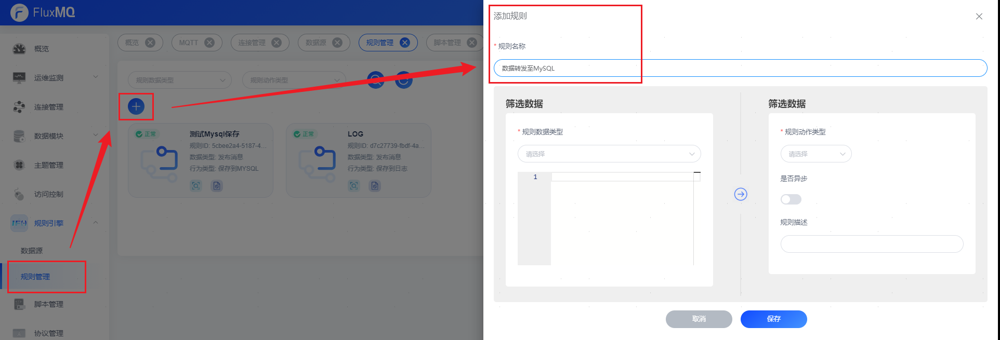
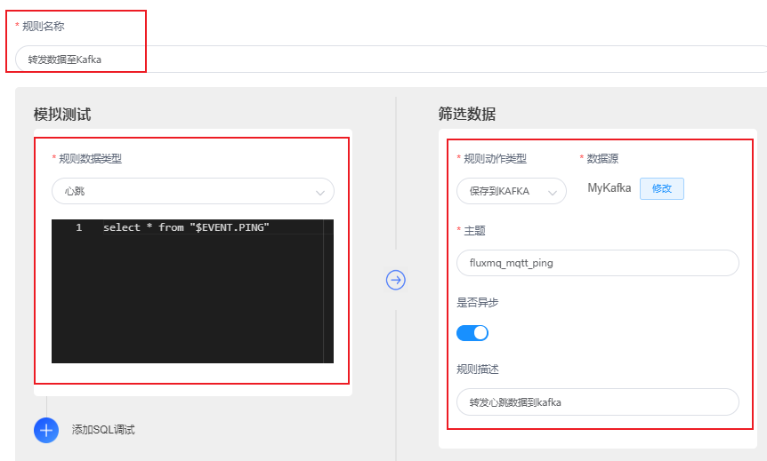
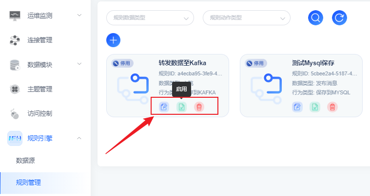

# 数据转发至Kafka储存

## 场景说明
对于上报的数据，可以选择让平台将上报数据推送给应用服务器，由应用服务器进行保存；还可以选择让平台将设备上报数据转发给分布式消息服务（Kafka），由Kafka进行存储。

本示例为将所有上报的数据转发至Kafka存储。

## 配置转发规则
1. 选择左侧导航栏的“规则引擎>规则管理”，单击左上角的“+”来新建规则。

2. 配置界面参考下表参数说明，填写规则内容。以下参数取值仅为示例，填写完成后单击“保存”。

| **参数名** | **参数说明**                 |
|---------|--------------------------|
| 规则名称    | 自定义，如mqtt-data-kafka     |
| 规则数据类型  | 下拉框选择事件类型                |
| 规则模板    | 编写数据转发SQL脚本              |
| 数据源     | 从已创建的数据源里选择Kafka实例       |
| 主题      | 填入Kafka接收数据的topic名       |
| 是否异步    | 指定异步存储开关                 |

3. 管理规则实例，可以通过看板界面继续编辑、启停用、删除操作
