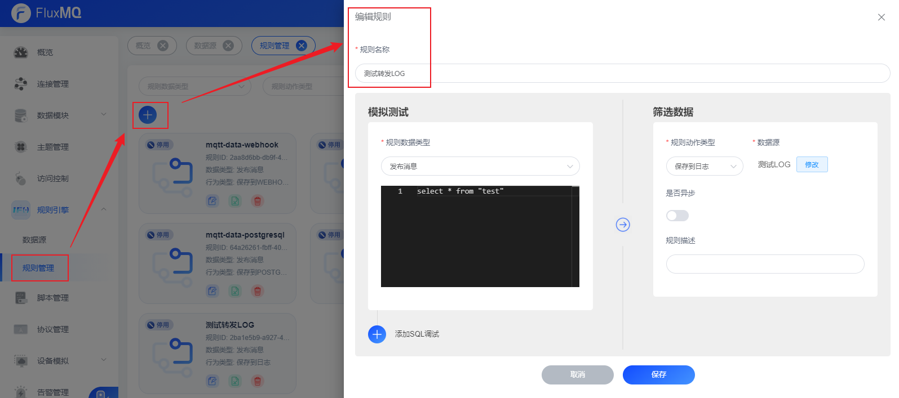
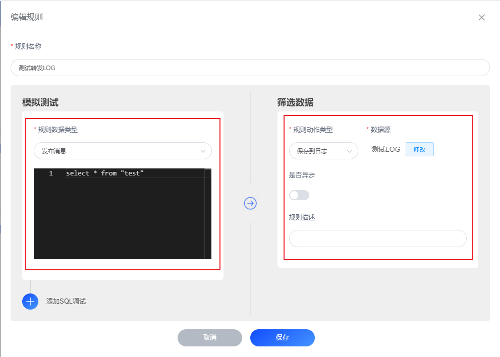

# 消息转发至HTTP服务

## 场景说明
对于平台的流转数据可以选择让平台将设备上报数据写入LOG

本示例为将流转数据转发至 LOG 日志中

## 配置转发规则
1. 选择左侧导航栏的“规则引擎>规则管理”，单击左上角的“+”来新建规则。
   

2. 配置界面参考下表参数说明，填写规则内容。以下参数取值仅为示例，填写完成后单击“保存”。

| **参数名** | **参数说明**                |
|---------|-------------------------|
| 规则名称    | 自定义，如mqtt-data-webhook。 |
| 规则数据类型  | 下拉框选择事件类型               |
| 规则模板    | 编写数据转发SQL脚本             |
| 规则动作类型  | 指定转发数据的接收端              |
| 数据源     | 从已创建的数据源里选择LOG实例        |
| 是否异步    | 指定异步存储开关                |

3. 管理规则实例，可以通过看板界面继续编辑、启停用、删除操作
