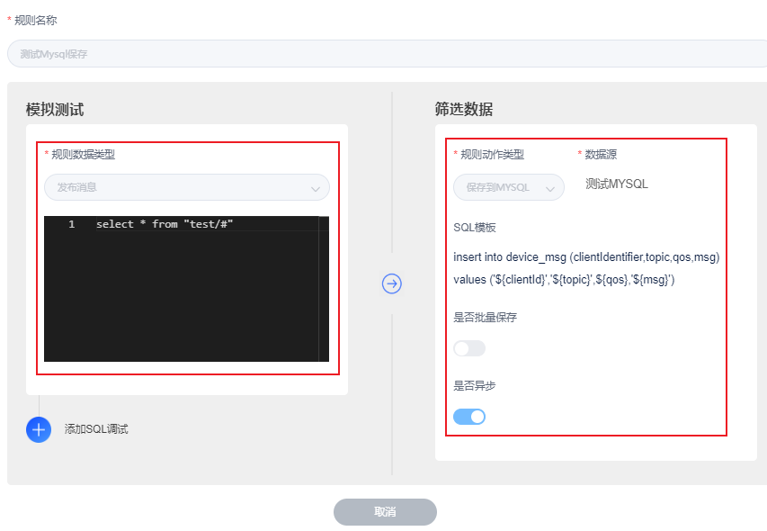
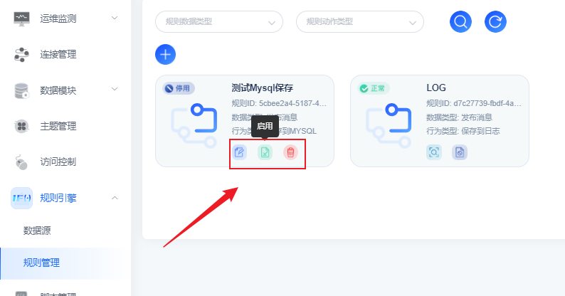

# 消息转发至MySQL存储

## 场景说明
对于平台的流转数据可以选择让平台将设备上报数据转发给多种数据库，由数据库进行存储，用户无需做额外的数据存储代码开发即可使用设备数据进行业务处理。

本示例为将流转数据转发至MySQL存储。

## 前提条件
- 拥有可使用的MySQL数据库实例

## 配置转发规则
1. 选择左侧导航栏的“规则引擎>规则管理”，单击左上角的“+”来新建规则。

2. 配置界面参考下表参数说明，填写规则内容。以下参数取值仅为示例，填写完成后单击“保存”。

| **参数名** | **参数说明**                 |
|---------|--------------------------|
| 规则名称    | 自定义，如mqtt-data-mysql。    |
| 规则数据类型  | 下拉框选择事件类型                |
| 规则模板    | 编写数据转发SQL脚本              |
| 数据源     | 从已创建的数据源里选择MySQL实例       |
| 是否批量保存  | 指定批量存储开关                 |
| 是否异步    | 指定异步存储开关                 |
| SQL模板   | 编写数据库写入SQL脚本，插入字段使用${}包裹 |

3. 管理规则实例，可以通过看板界面继续编辑、启停用、删除操作
