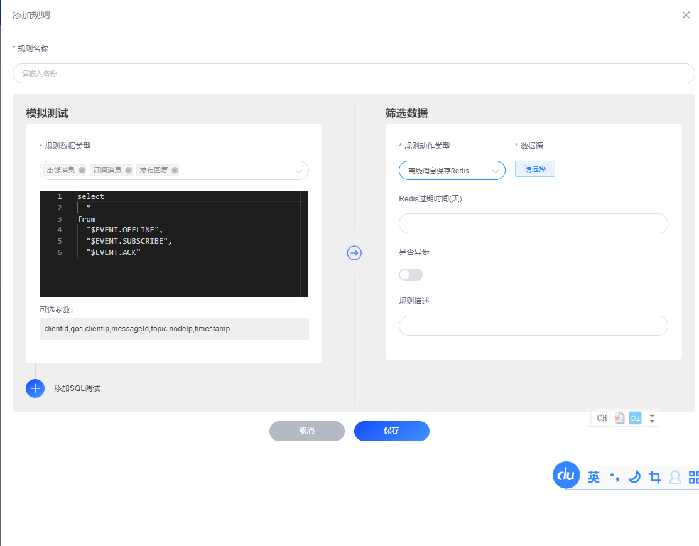

# 离线消息保存到Redis
在FluxMQ中，离线消息是一个独立的数据类型，离线消息定义：
- 指当客户端发布的时候，如果没有客户端订阅消息，那么此消息被定位成离线消息。
- ACK未确认的qos=1或者qos=2的消息，也被定位成离线消息。

使用`$EVENT.OFFLINE`来表示离线消息。
## 场景说明
支持配置离线消息，将消息保存到PostgreSQL数据库中。并配置订阅主题时候，将离线消息推送给客户端。并且根据客户的ACK回复，来删除离线消息。

## 前提条件
- 离线消息必须是Qos=1或者Qos=2的消息

## 配置离线消息处理规则
### 选择数据类

选择`离线消息`、`发布回复`、`订阅消息`,并且可以为SQL添加topic过滤条件，比如`topic =~ 'test/#'`。
### 离线消息保存到Redis

默认采用Hash数据结构，配置离线消息的过期时间。数据格式如下。

| **参数名** | **参数说明** | **参数示例** |
| --- | --- | --- |
| key | redis存储key |  MQTT:HB838931HB838931HB838931)|
| field | redis存储字段 | clientId |
| value | redis存储值 | 123123123123123123 |

#### SQL可以操作的字段参考`离线消息`数据结构

