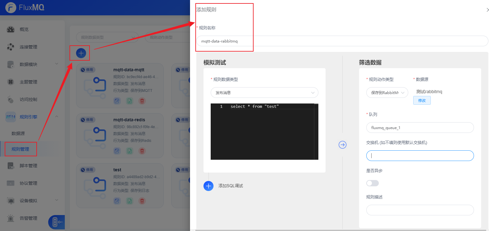
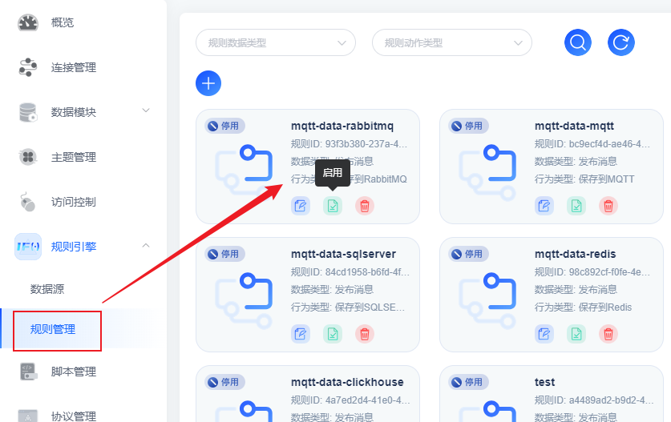

# 消息转发至RabbitMQ服务

## 场景说明
支持与 RabbitMQ 的数据集成，能够将设备数据和事件转发至 RabbitMQ

本示例为将流转数据转发至RabbitMQ服务。

## 前提条件
- 拥有可使用的RabbitMQ消息服务

## 配置转发规则
1. 选择左侧导航栏的“规则引擎>规则管理”，单击左上角的“+”来新建规则。
   

2. 配置界面参考下表参数说明，填写规则内容。以下参数取值仅为示例，填写完成后单击“保存”。

| **参数名** | **参数说明**                 |
|---------|--------------------------|
| 规则名称    | 自定义，如mqtt-data-rabbitmq。 |
| 规则数据类型  | 下拉框选择事件类型                |
| 规则模板    | 编写数据转发SQL脚本              |
| 规则动作类型  | 指定转发数据的接收端               |
| 数据源     | 从已创建的数据源里选择RabbitMQ实例    |
| 队列      | 转发到RabbitMQ服务的队列名        |
| 交换机     | 指定转发到RabbitMQ服务使用的交换机    |
| 是否异步    | 指定异步存储开关                 |

3. 管理规则实例，可以通过看板界面继续编辑、启停用、删除操作
