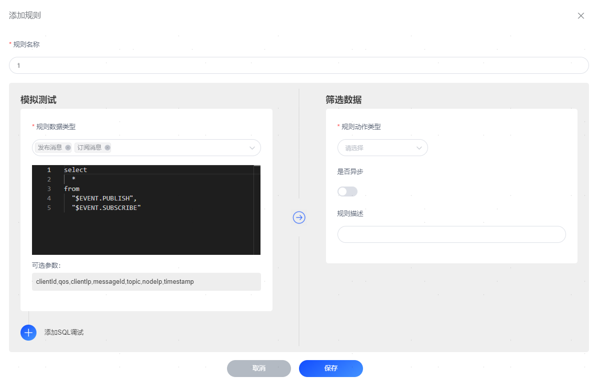
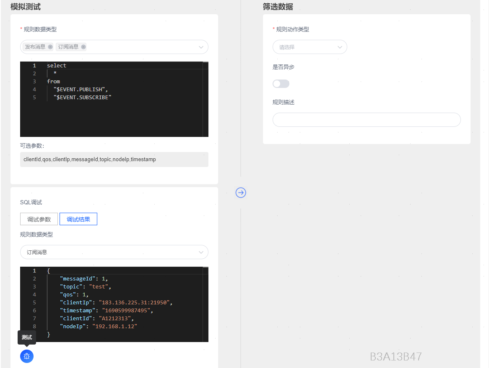
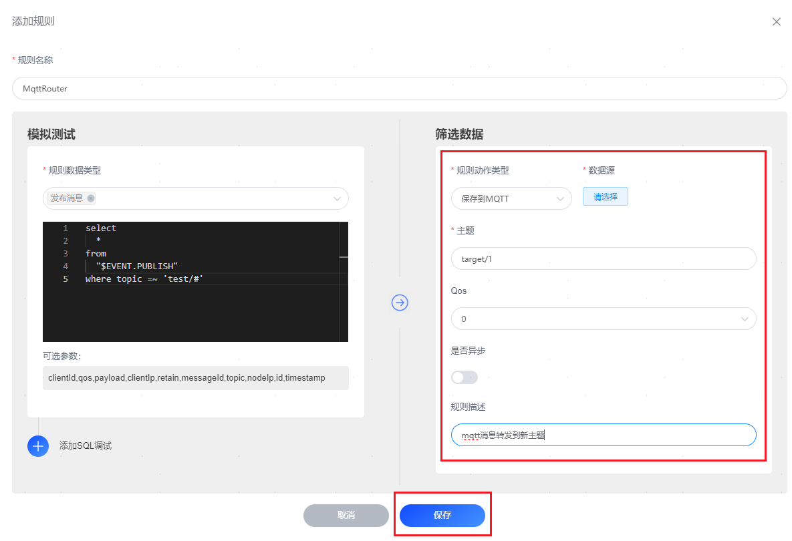
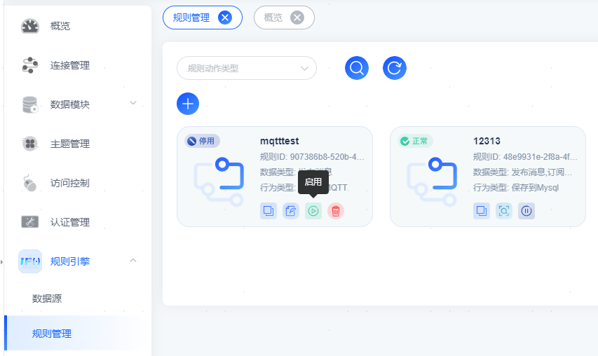
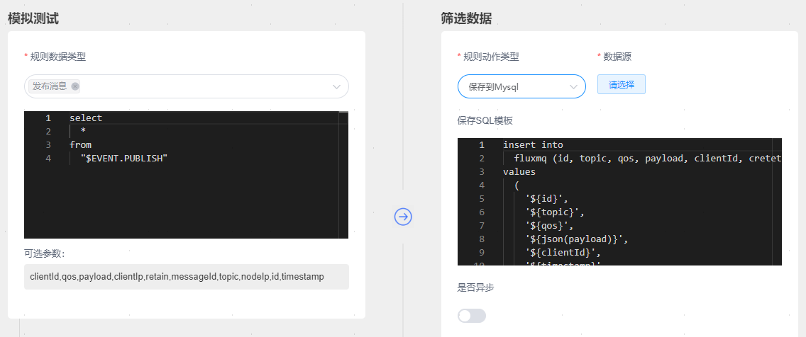

# 创建规则
本指南介绍如何在 FluxMQ Dashboard 中创建规则。登录 FluxMQ Dashboard，点击左侧导航目录中的 **规则引擎** -> **规则管理**。然后点击 + 创建**按钮，右侧滑出**规则配置页面。在这里，您可以定义规则的数据源，并确定消息过滤的后续操作，例如重新发布、将结果打印到日志文件或通过数据桥接进行转发。 以下步骤演示如何创建一个规则，该规则监听主题为 test/# 的消息，并将接收到的消息转发到主题 target/1。

## 定义规则
在**规则管理**页面上，输入规则的名称并添加备注以便未来管理。 在 **SQL 编辑器**中，可以通过下拉框选择符合您业务需求的**规则数据类型**，如发布消息、订阅消息等，支持多选。 配置 **规则动作类型** 指定数据转发的目标数据源和动作，数据源配置的详细信息参阅 FluxMQ-数据源配置手册。 FluxMQ 内置了丰富的 SQL 语句示例，以帮助您入门。您可以在 **SQL 编辑器**下点击 **添加SQL调试 **按钮进行探索。有关 SQL 语法和用法的更多详细信息，请参阅 <a href="GRAMMAR#jump1">**SQL 语法与示例**</a>。 

## 测试 SQL 语句
这是一个可选步骤，但如果您第一次使用 FluxMQ 规则引擎，建议进行测试。打开 **添加SQL调试** 开关，启用 SQL 语句测试。 FluxMQ 为所有字段提供了默认值，例如**节点IP**、**客户端 ID**、**用户名**、**主题**、**QoS**、**Payload** 等。您只需点击**测试**按钮即可开始测试。如果一切正常，将通过调试结果展示。  SQL 处理结果将以 JSON 形式呈现在**输出结果**部分。SQL 处理结果中的所有字段都可以通过后续操作（内置操作或数据桥接）以 ${key}的形式进行引用。有关字段的详细说明，请参阅 <a href="EVENT#jump1">**SQL 事件类型与字段**</a>。

## 添加消息重发布操作
要将主题为 test/# 的消息重新发布到主题 target/1，在页面右侧点击 **规则动作类型 **按钮。在下拉菜单中选择**MQTT数据源**，然后在点击 **保存 **按钮之前，配置以下设置：

- **主题**：在本示例中设置为目标主题 target/1；
- **Qos**：在本示例中设置为重新发布的消息的 QoS 为0；
- **是否异步**：在本示例中设置为非异步，可视转发效率配置与否；
- **规则描述**：说明此规则配置的作用，方便后续检查与管理。

 在**添加规则**页面，点击底部的 **保存 **按钮以完成规则创建。此规则将作为新条目添加到 **规则管理 **页面。您可以查看规则 ID、数据类型、行为类型。您还可以点击 **编辑 **来修改数据源或添加更多操作，或者点击 **复制规则、启用或禁用规则、删除规则 **。 

## 使用数据桥接转发
您还可以添加使用数据桥接转发的操作。您只需从 **规则动作类型 **下拉列表中选择目标数据源桥接即可。以转发mysql为例： 
