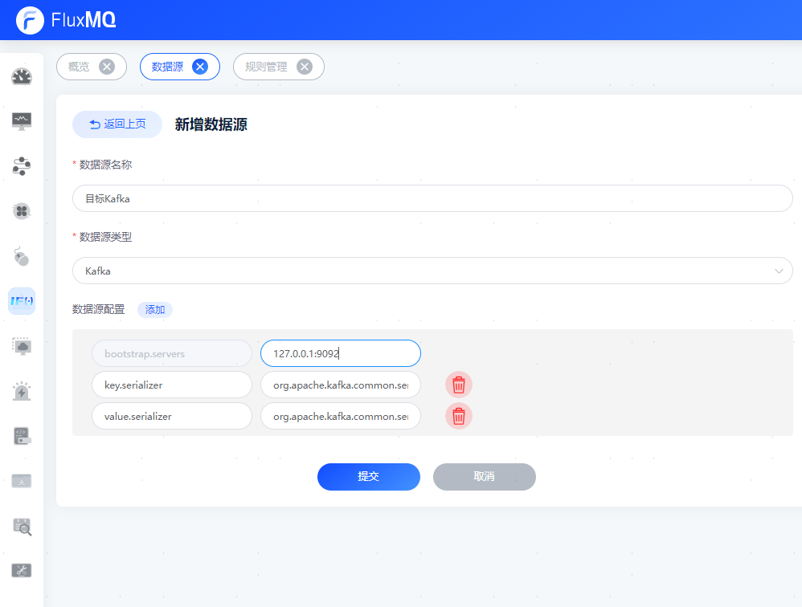
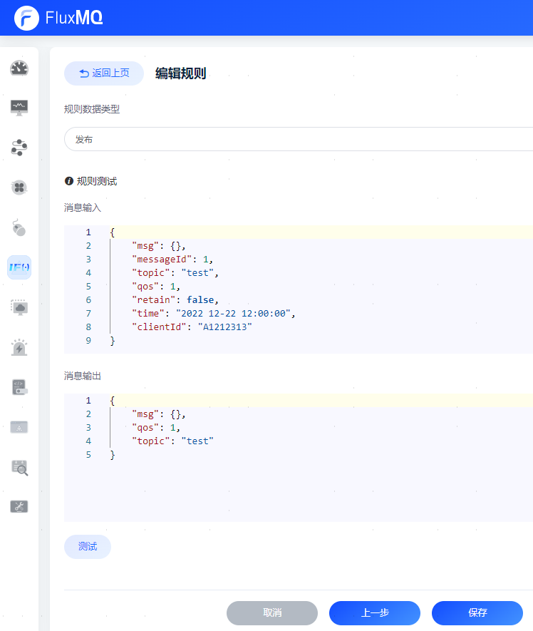

> 创建规则需再后台管理系统进行可视化配置；目前支持数据桥接，数据存储配置。
# 创建规则及调试

## 1. 创建规则
点击进入“规则引擎/规则管理/新增规则”

## 2. 配置数据源
新建数据源需在“规则引擎/数据源”进行添加

## 3. 配置响应动作
配置转发和数据桥接目标地址

## 4. 调试
点击 [下一步] 选择调试数据类型

进行规则调试

调试成功后，可进行保存
## 5. 启动规则
用户根据需求选择启动/停止规则

