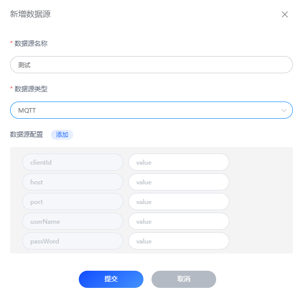

# MQTT
FLuxMQ提供将数据转发到第三方MQTT Broker的功能，可以将FluxMQ内部的数据流转发到第三方，提供系统的扩展性

## MQTT配置
> 配置MQTT的连接信息，用于连接第三方MQTT Broker

| 配置项               | 说明                                                          |
|-------------------|-------------------------------------------------------------|
| Broker地址             | 第三方MQTT Broker的地址，比如：tcp://
| 用户名             | 第三方MQTT Broker的用户名，比如：admin
| 密码             | 第三方MQTT Broker的密码，比如：admin
| 客户端ID             | 第三方MQTT Broker的客户端ID，比如：fluxmqtt
| QoS             | 第三方MQTT Broker的QoS，比如：0
| 保留             | 第三方MQTT Broker的保留，比如：false

