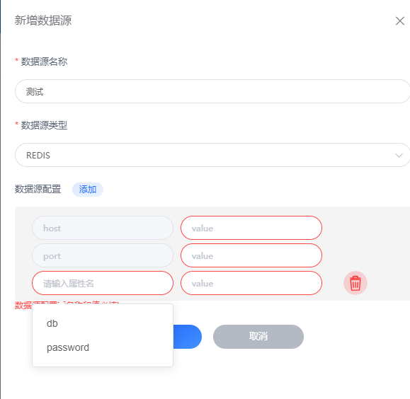

# Redis
FluxMQ提供了Redis的接入功能，可以将消息发送到Redis的发布订阅中（非持久化）。

## Redis配置

| 配置项  | 说明                   |
|------|----------------------|
| host | Redis的IP地址           |
| port | Redis的PORT           |
| 密码   | Redis的密码，比如：admin、可选 |
| DB   | Redis的数据库、可选         |
