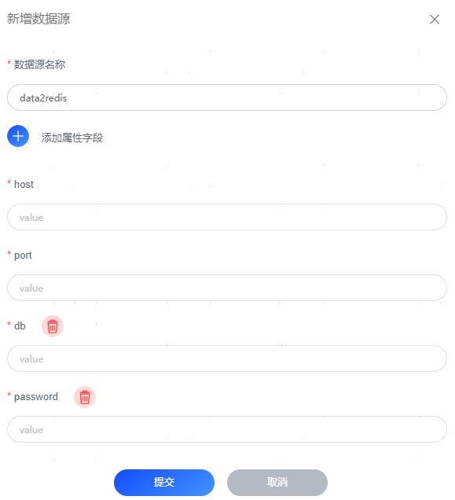

# Redis数据库
## 版本支持
- **2.9.2+**

## Redis配置

### 配置数据库连接信息
| 配置项      | 说明               |
|----------|------------------|
| host     | Redis的IP地址       |
| port     | Redis的PORT       |
| password | Redis的密码、可选      |
| db       | Redis的分区数据库、可选   |