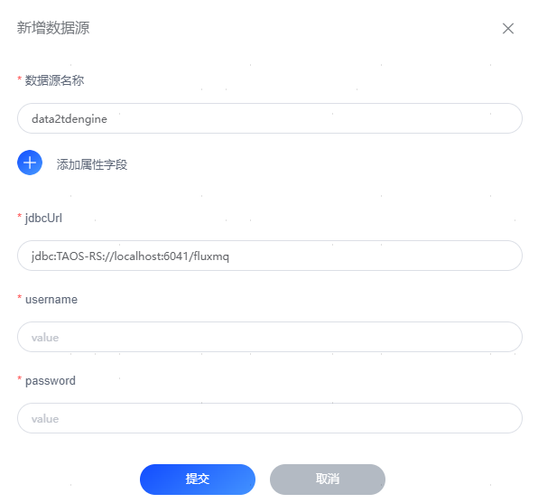

# TDengine数据库
## 版本支持
- **3.2.2+**

## TDengine配置

### 配置数据库连接信息
| 配置项      | 说明           |
|----------|--------------|
| jdbcUrl  | 连接串          |
| username | 用户名          |
| password | 密码           |
| 连接池参数    | 数据库配置属性字段、可选 |

